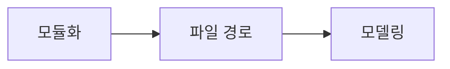

# DAY8 - 게임 모듈화와 DB 기초

[원문 보기](https://velog.io/@doldolkoong/%ED%94%8C%EB%A0%88%EC%9D%B4%EB%8D%B0%EC%9D%B4%ED%84%B0-SK%EB%84%A4%ED%8A%B8%EC%9B%8D%EC%8A%A4-Family-AI-%EC%BA%A0%ED%94%84-36%EA%B8%B0-DAY-8-2026.08.18) · 2026-09-08 정리

> [!tip] 💡 이 수업을 한 문장으로
> 게임 코드를 역할별로 분리하고 데이터를 저장하는 DB·SQL·ERD의 역할을 익힌다.

> [!example] 🎨 한 줄 비유
> 프로그램의 기능은 부서로 나누고 데이터는 공통 장부에 저장한다.

## 📌 선행지식

| 필요한 지식 | 어느 정도로? | 관련 노트 |
|---|---|---|
| 가위바위보·묵찌빠·하나빼기 모듈화 | 핵심 용어와 입력·출력 흐름 설명 | [[가위바위보·묵찌빠·하나빼기 모듈화\|가위바위보·묵찌빠·하나빼기 모듈화]] |
| DAY9 - MySQL 연결과 테이블 생성 | 핵심 용어와 입력·출력 흐름 설명 | [[DAY9 - MySQL 연결과 테이블 생성\|DAY9 - MySQL 연결과 테이블 생성]] |

## 🎯 학습 목표

- [ ] 게임 코드를 역할별로 분리하고 데이터를 저장하는 DB·SQL·ERD의 역할을 익힌다.
- [ ] 모듈화: 예제로 설명할 수 있다.
- [ ] 파일 경로: 예제로 설명할 수 있다.
- [ ] DB 도구: 예제로 설명할 수 있다.

## 1단원 — 핵심 정의 🟢 ⭐

### ① 무엇인가?

게임 코드를 역할별로 분리하고 데이터를 저장하는 DB·SQL·ERD의 역할을 익힌다.

### ② 왜 필요한가?

게임별 로직과 공통 입력·출력을 분리한다. DBMS·테이블·SQL의 역할을 연결해 간단한 모델을 그린다. 이를 통해 모듈화에서 모델링까지 연결해 이해한다.

### ③ 쉽게 이해하기 🎨

> [!example] 비유
> 프로그램의 기능은 부서로 나누고 데이터는 공통 장부에 저장한다.

### ④ 핵심 용어

| 용어 | 뜻과 적용 포인트 |
|---|---|
| 모듈화 | 각 게임을 함수·파일로 나누어 main에서 선택 실행한다. |
| 파일 경로 | .은 현재, ..은 부모 디렉터리이고 리눅스에서 점으로 시작하는 이름은 숨김 관례다. |
| DB 도구 | Docker에서 DB를 실행하고 DBeaver로 연결해 관리한다. |
| SQL 분류 | DDL은 구조 정의, DML은 데이터 조작, DCL은 권한 제어에 관한 명령이다. |
| 모델링 | 요구사항을 먼저 정하고 엔티티·속성·관계를 ERD로 표현한다. |

## 2단원 — 원리 / 동작 과정 🔵 ⭐

### ① 전체 흐름

1. 게임별 로직과 공통 입력·출력을 분리한다.
2. 저장해야 할 대상과 속성·관계를 정한다.
3. DBMS·테이블·SQL의 역할을 연결해 간단한 모델을 그린다.

### ② 왜 이렇게 동작하는가?

.은 현재, ..은 부모 디렉터리이고 리눅스에서 점으로 시작하는 이름은 숨김 관례다. 요구사항을 먼저 정하고 엔티티·속성·관계를 ERD로 표현한다.

### ③ 그림으로 설명



## 3단원 — 코드 / 공식 🔵 ⭐

### ① 핵심 코드

> 아래는 원문의 개념을 작은 입력으로 재구성한 학습용 예제다. 원문 코드는 하단 원문에서 확인할 수 있다.

```text
Player(player_id, name)
Game(game_id, game_type)
Result(result_id, player_id, game_id, outcome)

Player 1 --- N Result N --- 1 Game
```

### ② 코드 이해

| 읽는 순서 | 의미 |
|---|---|
| 입력과 전제 | 게임별 로직과 공통 입력·출력을 분리한다. |
| 처리 | 저장해야 할 대상과 속성·관계를 정한다. |
| 결과 | 학습을 위해 추가한 설계 예시다. 원문에서 빠진 수업 내용을 실제로 들었다고 가정한 기록은 아니다. |

### ③ 실행 결과

**예상 결과·해석 기준 — 실제 환경 실행 결과와 구분**

```text
한 사용자가 여러 게임 결과를 가질 수 있는 개념 모델 예시.
```

### ④ 결과 해석

학습을 위해 추가한 설계 예시다. 원문에서 빠진 수업 내용을 실제로 들었다고 가정한 기록은 아니다.

## 4단원 — 실습 🚀

### 🧪 실습

**문제**

테이블 생성과 사용자 권한 부여는 각각 어떤 SQL 분류인가?

**내 코드 / 내 풀이**

> 직접 풀이한 뒤 이 칸에 기록한다. 아래 해설을 보기 전에 먼저 답을 생각한다.

**결과·해석**

<details>
<summary>해설 보기</summary>

CREATE TABLE은 DDL, GRANT는 DCL이다. SELECT는 DML로 포함하거나 DQL로 별도 분류하기도 한다.

</details>

## 🔧 디버깅 포인트

| 증상 | 원인 | 해결 |
|---|---|---|
| ERD부터 그리고 요구사항 변경 반복 | 저장 목적 미정 | 어떤 질문과 기능에 필요한 데이터인지 먼저 정한다 |
| DBMS와 클라이언트를 혼동 | 서버와 접속 도구 역할 혼동 | MySQL과 DBeaver를 구분 |

## 🤖 ChatGPT 요약 붙여넣기

### 📚 이번 수업에서 배운 내용

- **모듈화**: 각 게임을 함수·파일로 나누어 main에서 선택 실행한다.
- **파일 경로**: .은 현재, ..은 부모 디렉터리이고 리눅스에서 점으로 시작하는 이름은 숨김 관례다.
- **DB 도구**: Docker에서 DB를 실행하고 DBeaver로 연결해 관리한다.
- **SQL 분류**: DDL은 구조 정의, DML은 데이터 조작, DCL은 권한 제어에 관한 명령이다.
- **모델링**: 요구사항을 먼저 정하고 엔티티·속성·관계를 ERD로 표현한다.

### 🔑 핵심 문장 3개

1. 게임 코드를 역할별로 분리하고 데이터를 저장하는 DB·SQL·ERD의 역할을 익힌다.
2. .은 현재, ..은 부모 디렉터리이고 리눅스에서 점으로 시작하는 이름은 숨김 관례다.
3. 요구사항을 먼저 정하고 엔티티·속성·관계를 ERD로 표현한다.

### ⚠️ 시험 / 면접 포인트

- 모듈화의 핵심은 무엇인가?
- 파일 경로를 잘못 이해하면 어떤 문제가 생기는가?
- 테이블 생성과 사용자 권한 부여는 각각 어떤 SQL 분류인가?

### ✅ 개념 체크리스트

- [ ] 모듈화의 의미와 원문에서 사용한 이유를 설명할 수 있는가?
- [ ] 파일 경로의 의미와 원문에서 사용한 이유를 설명할 수 있는가?
- [ ] DB 도구의 의미와 원문에서 사용한 이유를 설명할 수 있는가?
- [ ] SQL 분류의 의미와 원문에서 사용한 이유를 설명할 수 있는가?
- [ ] 모델링의 의미와 원문에서 사용한 이유를 설명할 수 있는가?

### ⚠️ 실수 방지 체크리스트

| 흔한 실수 | 바로잡기 |
|---|---|
| ERD부터 그리고 요구사항 변경 반복 | 어떤 질문과 기능에 필요한 데이터인지 먼저 정한다 |
| DBMS와 클라이언트를 혼동 | MySQL과 DBeaver를 구분 |

### 📝 미니 연습문제

1. 모듈화의 핵심은 무엇인가?

<details>
<summary>해설 보기</summary>

각 게임을 함수·파일로 나누어 main에서 선택 실행한다.

</details>

2. 파일 경로를 잘못 이해하면 어떤 문제가 생기는가?

<details>
<summary>해설 보기</summary>

.은 현재, ..은 부모 디렉터리이고 리눅스에서 점으로 시작하는 이름은 숨김 관례다.

</details>

3. 코드 또는 처리 예시의 결과를 설명하라.

<details>
<summary>해설 보기</summary>

학습을 위해 추가한 설계 예시다. 원문에서 빠진 수업 내용을 실제로 들었다고 가정한 기록은 아니다.

</details>

4. 테이블 생성과 사용자 권한 부여는 각각 어떤 SQL 분류인가?

<details>
<summary>해설 보기</summary>

CREATE TABLE은 DDL, GRANT는 DCL이다. SELECT는 DML로 포함하거나 DQL로 별도 분류하기도 한다.

</details>

# 🔁 복습 스케줄

- [ ] **1일 복습** [stage:: 1D] [due:: 2026-09-09]
- [ ] **7일 복습** [stage:: 7D] [due:: 2026-09-15]
- [ ] **30일 복습** [stage:: 30D] [due:: 2026-10-08]

### 복습 방법

1. 요약을 가리고 핵심 개념 3개를 설명한다.
2. 예제 또는 처리 흐름을 보지 않고 재현한다.
3. 해설과 비교하고 틀린 부분을 기록한다.
4. 실제 복습을 마친 뒤 체크한다.

## 🔗 관련 노트

- [[가위바위보·묵찌빠·하나빼기 모듈화|가위바위보·묵찌빠·하나빼기 모듈화]]
- [[DAY9 - MySQL 연결과 테이블 생성|DAY9 - MySQL 연결과 테이블 생성]]
- [[SAFE - 요구사항 정의|SAFE - 요구사항 정의]]
- [[00_Dashboard/Velog 학습 자료 목차|전체 32개 글 목차]]

## 📎 원문과 확인 자료

- [Velog 원문](https://velog.io/@doldolkoong/%ED%94%8C%EB%A0%88%EC%9D%B4%EB%8D%B0%EC%9D%B4%ED%84%B0-SK%EB%84%A4%ED%8A%B8%EC%9B%8D%EC%8A%A4-Family-AI-%EC%BA%A0%ED%94%84-36%EA%B8%B0-DAY-8-2026.08.18)


> [!quote]- 원문 전체 보기 — 코드·표·이미지 링크 포함
> ![[90_Sources/Velog/21 - DAY8 - 게임 모듈화와 DB 기초 - 원문]]
