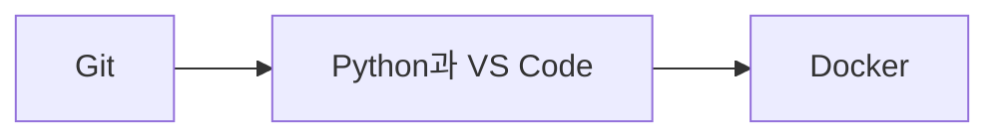

# DAY1 - 개발 환경 구축

[원문 보기](https://velog.io/@doldolkoong/%ED%94%8C%EB%A0%88%EC%9D%B4%EB%8D%B0%EC%9D%B4%ED%84%B0-SK%EB%84%A4%ED%8A%B8%EC%9B%8D%EC%8A%A4-Family-AI-%EC%BA%A0%ED%94%84-36%EA%B8%B0-DAY1-%EC%88%98%EC%97%85-%EC%A0%95%EB%A6%AC-26.08.06) · 2026-09-08 정리

> [!attention] 원문 확인·보완
> 원문의 버전·삭제·실행 정책 변경은 당시 환경 기록이다. 새 환경에서 그대로 반복할 필수 절차로 취급하지 않는다.

> [!tip] 💡 이 수업을 한 문장으로
> 개발 도구별 역할과 설치 확인 절차를 연결해 재현 가능한 학습 환경을 준비한다.

> [!example] 🎨 한 줄 비유
> 실습을 시작하기 전에 공구·작업대·기록장을 준비하고 하나씩 작동을 확인한다.

## 📌 선행지식

| 필요한 지식 | 어느 정도로? | 관련 노트 |
|---|---|---|
| DAY2 - Git과 Python 가상환경 및 변수 | 핵심 용어와 입력·출력 흐름 설명 | [[DAY2 - Git과 Python 가상환경 및 변수\|DAY2 - Git과 Python 가상환경 및 변수]] |
| 1주차 주간 회고 - 개발 환경과 학습 습관 | 핵심 용어와 입력·출력 흐름 설명 | [[98_Review/Velog/1주차 주간 회고 - 개발 환경과 학습 습관\|1주차 주간 회고 - 개발 환경과 학습 습관]] |

## 🎯 학습 목표

- [ ] 개발 도구별 역할과 설치 확인 절차를 연결해 재현 가능한 학습 환경을 준비한다.
- [ ] Git: 예제로 설명할 수 있다.
- [ ] Python과 VS Code: 예제로 설명할 수 있다.
- [ ] 작업 폴더: 예제로 설명할 수 있다.

## 1단원 — 핵심 정의 🟢 ⭐

### ① 무엇인가?

개발 도구별 역할과 설치 확인 절차를 연결해 재현 가능한 학습 환경을 준비한다.

### ② 왜 필요한가?

필요한 도구와 버전·폴더 구조를 기록한다. 강의 자료를 clone하고 작은 Python 파일이 해당 환경에서 실행되는지 확인한다. 이를 통해 Git에서 Docker까지 연결해 이해한다.

### ③ 쉽게 이해하기 🎨

> [!example] 비유
> 실습을 시작하기 전에 공구·작업대·기록장을 준비하고 하나씩 작동을 확인한다.

### ④ 핵심 용어

| 용어 | 뜻과 적용 포인트 |
|---|---|
| Git | 코드 변경 이력과 협업 기반을 제공한다. |
| Python과 VS Code | 실행기와 편집기를 구별하고 확장·인터프리터 선택을 확인한다. |
| 작업 폴더 | course·study·project처럼 자료·연습·프로젝트 역할을 나눈다. |
| uv와 WSL | 환경·패키지 관리와 Windows에서의 Linux 실행 환경을 각각 이해한다. |
| Docker | 프로그램 실행 환경을 컨테이너로 다룬다. 설치 후 상태를 확인한다. |

## 2단원 — 원리 / 동작 과정 🔵 ⭐

### ① 전체 흐름

1. 필요한 도구와 버전·폴더 구조를 기록한다.
2. 순서대로 설치·설정하고 각 도구의 버전과 경로를 확인한다.
3. 강의 자료를 clone하고 작은 Python 파일이 해당 환경에서 실행되는지 확인한다.

### ② 왜 이렇게 동작하는가?

실행기와 편집기를 구별하고 확장·인터프리터 선택을 확인한다. 프로그램 실행 환경을 컨테이너로 다룬다. 설치 후 상태를 확인한다.

### ③ 그림으로 설명



## 3단원 — 코드 / 공식 🔵 ⭐

### ① 핵심 코드

> 아래는 원문의 개념을 작은 입력으로 재구성한 학습용 예제다. 원문 코드는 하단 원문에서 확인할 수 있다.

```powershell
git --version
python --version
uv --version
wsl --status
docker --version
```

### ② 코드 이해

| 읽는 순서 | 의미 |
|---|---|
| 입력과 전제 | 필요한 도구와 버전·폴더 구조를 기록한다. |
| 처리 | 순서대로 설치·설정하고 각 도구의 버전과 경로를 확인한다. |
| 결과 | 당시 설치 기록을 학습용으로 정리한 것이다. 현재 PC에서 설치·삭제·실행 정책 변경을 수행한 결과가 아니다. |

### ③ 실행 결과

**예상 결과·해석 기준 — 실제 환경 실행 결과와 구분**

```text
각 도구가 설치·등록되어 있다면 버전 또는 상태 정보가 나온다.
```

### ④ 결과 해석

당시 설치 기록을 학습용으로 정리한 것이다. 현재 PC에서 설치·삭제·실행 정책 변경을 수행한 결과가 아니다.

## 4단원 — 실습 🚀

### 🧪 실습

**문제**

VS Code 설치만으로 Python 실행 환경도 모두 갖춰지는가?

**내 코드 / 내 풀이**

> 직접 풀이한 뒤 이 칸에 기록한다. 아래 해설을 보기 전에 먼저 답을 생각한다.

**결과·해석**

<details>
<summary>해설 보기</summary>

아니다. 편집기와 Python 인터프리터·필요 패키지는 별도로 확인해야 한다.

</details>

## 🔧 디버깅 포인트

| 증상 | 원인 | 해결 |
|---|---|---|
| 명령을 찾지 못함 | 설치·PATH·터미널 세션 미확인 | 설치 경로와 새 터미널에서 조회 |
| 편집기는 실행되지만 Python 실행 실패 | 편집기와 인터프리터 역할 혼동 | 선택된 Python 경로와 환경을 확인 |

## 🤖 ChatGPT 요약 붙여넣기

### 📚 이번 수업에서 배운 내용

- **Git**: 코드 변경 이력과 협업 기반을 제공한다.
- **Python과 VS Code**: 실행기와 편집기를 구별하고 확장·인터프리터 선택을 확인한다.
- **작업 폴더**: course·study·project처럼 자료·연습·프로젝트 역할을 나눈다.
- **uv와 WSL**: 환경·패키지 관리와 Windows에서의 Linux 실행 환경을 각각 이해한다.
- **Docker**: 프로그램 실행 환경을 컨테이너로 다룬다. 설치 후 상태를 확인한다.

### 🔑 핵심 문장 3개

1. 개발 도구별 역할과 설치 확인 절차를 연결해 재현 가능한 학습 환경을 준비한다.
2. 실행기와 편집기를 구별하고 확장·인터프리터 선택을 확인한다.
3. 프로그램 실행 환경을 컨테이너로 다룬다. 설치 후 상태를 확인한다.

### ⚠️ 시험 / 면접 포인트

- Git의 핵심은 무엇인가?
- Python과 VS Code를 잘못 이해하면 어떤 문제가 생기는가?
- VS Code 설치만으로 Python 실행 환경도 모두 갖춰지는가?

### ✅ 개념 체크리스트

- [ ] Git의 의미와 원문에서 사용한 이유를 설명할 수 있는가?
- [ ] Python과 VS Code의 의미와 원문에서 사용한 이유를 설명할 수 있는가?
- [ ] 작업 폴더의 의미와 원문에서 사용한 이유를 설명할 수 있는가?
- [ ] uv와 WSL의 의미와 원문에서 사용한 이유를 설명할 수 있는가?
- [ ] Docker의 의미와 원문에서 사용한 이유를 설명할 수 있는가?

### ⚠️ 실수 방지 체크리스트

| 흔한 실수 | 바로잡기 |
|---|---|
| 명령을 찾지 못함 | 설치 경로와 새 터미널에서 조회 |
| 편집기는 실행되지만 Python 실행 실패 | 선택된 Python 경로와 환경을 확인 |

### 📝 미니 연습문제

1. Git의 핵심은 무엇인가?

<details>
<summary>해설 보기</summary>

코드 변경 이력과 협업 기반을 제공한다.

</details>

2. Python과 VS Code를 잘못 이해하면 어떤 문제가 생기는가?

<details>
<summary>해설 보기</summary>

실행기와 편집기를 구별하고 확장·인터프리터 선택을 확인한다.

</details>

3. 코드 또는 처리 예시의 결과를 설명하라.

<details>
<summary>해설 보기</summary>

당시 설치 기록을 학습용으로 정리한 것이다. 현재 PC에서 설치·삭제·실행 정책 변경을 수행한 결과가 아니다.

</details>

4. VS Code 설치만으로 Python 실행 환경도 모두 갖춰지는가?

<details>
<summary>해설 보기</summary>

아니다. 편집기와 Python 인터프리터·필요 패키지는 별도로 확인해야 한다.

</details>

# 🔁 복습 스케줄

- [ ] **1일 복습** [stage:: 1D] [due:: 2026-09-09]
- [ ] **7일 복습** [stage:: 7D] [due:: 2026-09-15]
- [ ] **30일 복습** [stage:: 30D] [due:: 2026-10-08]

### 복습 방법

1. 요약을 가리고 핵심 개념 3개를 설명한다.
2. 예제 또는 처리 흐름을 보지 않고 재현한다.
3. 해설과 비교하고 틀린 부분을 기록한다.
4. 실제 복습을 마친 뒤 체크한다.

## 🔗 관련 노트

- [[DAY2 - Git과 Python 가상환경 및 변수|DAY2 - Git과 Python 가상환경 및 변수]]
- [[98_Review/Velog/1주차 주간 회고 - 개발 환경과 학습 습관|1주차 주간 회고 - 개발 환경과 학습 습관]]
- [[00_Dashboard/Velog 학습 자료 목차|전체 32개 글 목차]]

## 📎 원문과 확인 자료

- [Velog 원문](https://velog.io/@doldolkoong/%ED%94%8C%EB%A0%88%EC%9D%B4%EB%8D%B0%EC%9D%B4%ED%84%B0-SK%EB%84%A4%ED%8A%B8%EC%9B%8D%EC%8A%A4-Family-AI-%EC%BA%A0%ED%94%84-36%EA%B8%B0-DAY1-%EC%88%98%EC%97%85-%EC%A0%95%EB%A6%AC-26.08.06)


> [!quote]- 원문 전체 보기 — 코드·표·이미지 링크 포함
> ![[90_Sources/Velog/32 - DAY1 - 개발 환경 구축 - 원문]]
