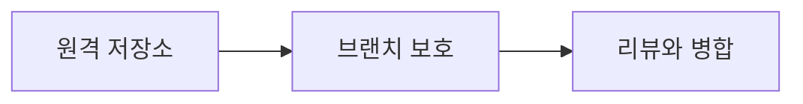

# DAY12 - GitHub 팀 협업과 PR

[원문 보기](https://velog.io/@doldolkoong/%ED%94%8C%EB%A0%88%EC%9D%B4%EB%8D%B0%EC%9D%B4%ED%84%B0-SK%EB%84%A4%ED%8A%B8%EC%9B%8D%EC%8A%A4-Family-AI-%EC%BA%A0%ED%94%84-36%EA%B8%B0-DAY12-26.08.24) · 2026-09-08 정리

> [!tip] 💡 이 수업을 한 문장으로
> 브랜치·보호 규칙·검토·병합 절차를 정해 팀 코드 변경을 관리한다.

> [!example] 🎨 한 줄 비유
> 공동 문서에 누구나 바로 덮어쓰는 대신 변경 제안을 검토한 후 반영한다.

## 📌 선행지식

| 필요한 지식 | 어느 정도로? | 관련 노트 |
|---|---|---|
| DAY2 - Git과 Python 가상환경 및 변수 | 핵심 용어와 입력·출력 흐름 설명 | [[DAY2 - Git과 Python 가상환경 및 변수\|DAY2 - Git과 Python 가상환경 및 변수]] |
| 4주차 주간 회고 - 협업과 SAFE 및 NumPy·pandas | 핵심 용어와 입력·출력 흐름 설명 | [[98_Review/Velog/4주차 주간 회고 - 협업과 SAFE 및 NumPy·pandas\|4주차 주간 회고 - 협업과 SAFE 및 NumPy·pandas]] |

## 🎯 학습 목표

- [ ] 브랜치·보호 규칙·검토·병합 절차를 정해 팀 코드 변경을 관리한다.
- [ ] 원격 저장소: 예제로 설명할 수 있다.
- [ ] 브랜치 보호: 예제로 설명할 수 있다.
- [ ] 로컬과 원격: 예제로 설명할 수 있다.

## 1단원 — 핵심 정의 🟢 ⭐

### ① 무엇인가?

브랜치·보호 규칙·검토·병합 절차를 정해 팀 코드 변경을 관리한다.

### ② 왜 필요한가?

저장소와 협업용 브랜치·접근 권한·보호 조건을 정한다. 리뷰·필수 검사를 확인한 후 병합된 브랜치의 결과를 검증한다. 이를 통해 원격 저장소에서 리뷰와 병합까지 연결해 이해한다.

### ③ 쉽게 이해하기 🎨

> [!example] 비유
> 공동 문서에 누구나 바로 덮어쓰는 대신 변경 제안을 검토한 후 반영한다.

### ④ 핵심 용어

| 용어 | 뜻과 적용 포인트 |
|---|---|
| 원격 저장소 | 프로젝트 저장소를 만들고 작업 환경에 clone한다. |
| 브랜치 보호 | PR·승인 요구와 우회 규칙을 정한다. 실제 적용 옵션은 저장소 환경에 따라 확인한다. |
| 로컬과 원격 | 로컬 브랜치를 만들었다고 원격에 자동 생성되는 것은 아니다. |
| 기본 브랜치 | clone과 PR의 기본 기준을 정하지만 개별 PR의 base는 따로 확인해야 한다. |
| 리뷰와 병합 | 변경 diff를 검토한다. Comment와 Approve는 같은 동작이 아니며 보호 규칙을 충족해야 병합된다. |

## 2단원 — 원리 / 동작 과정 🔵 ⭐

### ① 전체 흐름

1. 저장소와 협업용 브랜치·접근 권한·보호 조건을 정한다.
2. 각자 작업 브랜치에서 변경하고 PR의 base와 compare를 확인한다.
3. 리뷰·필수 검사를 확인한 후 병합된 브랜치의 결과를 검증한다.

### ② 왜 이렇게 동작하는가?

PR·승인 요구와 우회 규칙을 정한다. 실제 적용 옵션은 저장소 환경에 따라 확인한다. 변경 diff를 검토한다. Comment와 Approve는 같은 동작이 아니며 보호 규칙을 충족해야 병합된다.

### ③ 그림으로 설명



## 3단원 — 코드 / 공식 🔵 ⭐

### ① 핵심 코드

> 아래는 원문의 개념을 작은 입력으로 재구성한 학습용 예제다. 원문 코드는 하단 원문에서 확인할 수 있다.

```bash
git status
git branch -a
git log --oneline --graph --all -8
```

### ② 코드 이해

| 읽는 순서 | 의미 |
|---|---|
| 입력과 전제 | 저장소와 협업용 브랜치·접근 권한·보호 조건을 정한다. |
| 처리 | 각자 작업 브랜치에서 변경하고 PR의 base와 compare를 확인한다. |
| 결과 | 읽기용 확인 명령이다. 실제 저장소 생성·팀원 초대·PR 발송은 수행하지 않았다. |

### ③ 실행 결과

**예상 결과·해석 기준 — 실제 환경 실행 결과와 구분**

```text
현재 변경 상태, 로컬·원격 브랜치 목록, 최근 커밋 관계를 조회한다.
```

### ④ 결과 해석

읽기용 확인 명령이다. 실제 저장소 생성·팀원 초대·PR 발송은 수행하지 않았다.

## 4단원 — 실습 🚀

### 🧪 실습

**문제**

로컬에서 dev를 만들었는데 GitHub에 없다면?

**내 코드 / 내 풀이**

> 직접 풀이한 뒤 이 칸에 기록한다. 아래 해설을 보기 전에 먼저 답을 생각한다.

**결과·해석**

<details>
<summary>해설 보기</summary>

원격에 게시(push)되었는지 확인한다. 이름이 같은 로컬 브랜치와 원격 추적 브랜치는 구분해서 본다.

</details>

## 🔧 디버깅 포인트

| 증상 | 원인 | 해결 |
|---|---|---|
| PR을 원하지 않는 브랜치로 병합 | base 확인 누락 | PR 생성·병합 전 대상 브랜치 확인 |
| 댓글을 달았는데 승인 조건 미충족 | Comment와 Approve 혼동 | 리뷰 상태와 필수 승인 수 확인 |

## 🤖 ChatGPT 요약 붙여넣기

### 📚 이번 수업에서 배운 내용

- **원격 저장소**: 프로젝트 저장소를 만들고 작업 환경에 clone한다.
- **브랜치 보호**: PR·승인 요구와 우회 규칙을 정한다. 실제 적용 옵션은 저장소 환경에 따라 확인한다.
- **로컬과 원격**: 로컬 브랜치를 만들었다고 원격에 자동 생성되는 것은 아니다.
- **기본 브랜치**: clone과 PR의 기본 기준을 정하지만 개별 PR의 base는 따로 확인해야 한다.
- **리뷰와 병합**: 변경 diff를 검토한다. Comment와 Approve는 같은 동작이 아니며 보호 규칙을 충족해야 병합된다.

### 🔑 핵심 문장 3개

1. 브랜치·보호 규칙·검토·병합 절차를 정해 팀 코드 변경을 관리한다.
2. PR·승인 요구와 우회 규칙을 정한다. 실제 적용 옵션은 저장소 환경에 따라 확인한다.
3. 변경 diff를 검토한다. Comment와 Approve는 같은 동작이 아니며 보호 규칙을 충족해야 병합된다.

### ⚠️ 시험 / 면접 포인트

- 원격 저장소의 핵심은 무엇인가?
- 브랜치 보호를 잘못 이해하면 어떤 문제가 생기는가?
- 로컬에서 dev를 만들었는데 GitHub에 없다면?

### ✅ 개념 체크리스트

- [ ] 원격 저장소의 의미와 원문에서 사용한 이유를 설명할 수 있는가?
- [ ] 브랜치 보호의 의미와 원문에서 사용한 이유를 설명할 수 있는가?
- [ ] 로컬과 원격의 의미와 원문에서 사용한 이유를 설명할 수 있는가?
- [ ] 기본 브랜치의 의미와 원문에서 사용한 이유를 설명할 수 있는가?
- [ ] 리뷰와 병합의 의미와 원문에서 사용한 이유를 설명할 수 있는가?

### ⚠️ 실수 방지 체크리스트

| 흔한 실수 | 바로잡기 |
|---|---|
| PR을 원하지 않는 브랜치로 병합 | PR 생성·병합 전 대상 브랜치 확인 |
| 댓글을 달았는데 승인 조건 미충족 | 리뷰 상태와 필수 승인 수 확인 |

### 📝 미니 연습문제

1. 원격 저장소의 핵심은 무엇인가?

<details>
<summary>해설 보기</summary>

프로젝트 저장소를 만들고 작업 환경에 clone한다.

</details>

2. 브랜치 보호를 잘못 이해하면 어떤 문제가 생기는가?

<details>
<summary>해설 보기</summary>

PR·승인 요구와 우회 규칙을 정한다. 실제 적용 옵션은 저장소 환경에 따라 확인한다.

</details>

3. 코드 또는 처리 예시의 결과를 설명하라.

<details>
<summary>해설 보기</summary>

읽기용 확인 명령이다. 실제 저장소 생성·팀원 초대·PR 발송은 수행하지 않았다.

</details>

4. 로컬에서 dev를 만들었는데 GitHub에 없다면?

<details>
<summary>해설 보기</summary>

원격에 게시(push)되었는지 확인한다. 이름이 같은 로컬 브랜치와 원격 추적 브랜치는 구분해서 본다.

</details>

# 🔁 복습 스케줄

- [ ] **1일 복습** [stage:: 1D] [due:: 2026-09-09]
- [ ] **7일 복습** [stage:: 7D] [due:: 2026-09-15]
- [ ] **30일 복습** [stage:: 30D] [due:: 2026-10-08]

### 복습 방법

1. 요약을 가리고 핵심 개념 3개를 설명한다.
2. 예제 또는 처리 흐름을 보지 않고 재현한다.
3. 해설과 비교하고 틀린 부분을 기록한다.
4. 실제 복습을 마친 뒤 체크한다.

## 🔗 관련 노트

- [[DAY2 - Git과 Python 가상환경 및 변수|DAY2 - Git과 Python 가상환경 및 변수]]
- [[98_Review/Velog/4주차 주간 회고 - 협업과 SAFE 및 NumPy·pandas|4주차 주간 회고 - 협업과 SAFE 및 NumPy·pandas]]
- [[SAFE - 요구사항 정의|SAFE - 요구사항 정의]]
- [[00_Dashboard/Velog 학습 자료 목차|전체 32개 글 목차]]

## 📎 원문과 확인 자료

- [Velog 원문](https://velog.io/@doldolkoong/%ED%94%8C%EB%A0%88%EC%9D%B4%EB%8D%B0%EC%9D%B4%ED%84%B0-SK%EB%84%A4%ED%8A%B8%EC%9B%8D%EC%8A%A4-Family-AI-%EC%BA%A0%ED%94%84-36%EA%B8%B0-DAY12-26.08.24)


> [!quote]- 원문 전체 보기 — 코드·표·이미지 링크 포함
> ![[90_Sources/Velog/18 - DAY12 - GitHub 팀 협업과 PR - 원문]]
