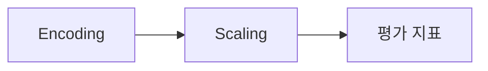

# DAY21 - 인코딩과 스케일링 및 모델 평가

[원문 보기](https://velog.io/@doldolkoong/%ED%94%8C%EB%A0%88%EC%9D%B4%EB%8D%B0%EC%9D%B4%ED%84%B0-SK%EB%84%A4%ED%8A%B8%EC%9B%8D%EC%8A%A4-Family-AI-%EC%BA%A0%ED%94%84-36%EA%B8%B0-DAY21-2026.09.03-76c2q711) · 2026-09-08 정리

> [!tip] 💡 이 수업을 한 문장으로
> 범주형과 수치형 전처리를 분리하고 학습한 변환기로 Test를 동일한 구조로 만든다.

> [!example] 🎨 한 줄 비유
> 시험지의 단위를 문제집과 같은 기준으로 환산하되 시험지를 보고 환산 규칙을 바꾸지 않는다.

## 📌 선행지식

| 필요한 지식 | 어느 정도로? | 관련 노트 |
|---|---|---|
| DAY20 - 머신러닝 워크플로우와 데이터 누수 | 핵심 용어와 입력·출력 흐름 설명 | [[DAY20 - 머신러닝 워크플로우와 데이터 누수\|DAY20 - 머신러닝 워크플로우와 데이터 누수]] |
| DAY22 - 선형 회귀와 경사하강법 및 분류 평가 | 핵심 용어와 입력·출력 흐름 설명 | [[DAY22 - 선형 회귀와 경사하강법 및 분류 평가\|DAY22 - 선형 회귀와 경사하강법 및 분류 평가]] |

## 🎯 학습 목표

- [ ] 범주형과 수치형 전처리를 분리하고 학습한 변환기로 Test를 동일한 구조로 만든다.
- [ ] Encoding: 예제로 설명할 수 있다.
- [ ] Scaling: 예제로 설명할 수 있다.
- [ ] fit과 transform: 예제로 설명할 수 있다.

## 1단원 — 핵심 정의 🟢 ⭐

### ① 무엇인가?

범주형과 수치형 전처리를 분리하고 학습한 변환기로 Test를 동일한 구조로 만든다.

### ② 왜 필요한가?

Train/Test를 나누고 학습 기준으로 결측을 처리한다. 인덱스와 컬럼을 맞춰 결합한 뒤 모델을 fit → predict → 평가한다. 이를 통해 Encoding에서 평가 지표까지 연결해 이해한다.

### ③ 쉽게 이해하기 🎨

> [!example] 비유
> 시험지의 단위를 문제집과 같은 기준으로 환산하되 시험지를 보고 환산 규칙을 바꾸지 않는다.

### ④ 핵심 용어

| 용어 | 뜻과 적용 포인트 |
|---|---|
| Encoding | 범주형 값에 모델이 사용할 수 있는 수치 표현을 부여한다. |
| Scaling | Standard·MinMax·Robust 등 데이터 분포와 모델에 맞는 크기 변환을 선택한다. |
| fit과 transform | 학습 데이터에서 규칙을 만들고 Test에는 저장한 규칙을 적용한다. |
| 열과 인덱스 | 인코딩 결과를 합칠 때 행 대응, 열 이름, 열 순서, 열 개수가 일치해야 한다. |
| 평가 지표 | R²·MSE·RMSE·MAE·MAPE의 단위와 오차 해석을 구분한다. 원문 Titanic 정확도 79.3%는 당시 실험 결과다. |

## 2단원 — 원리 / 동작 과정 🔵 ⭐

### ① 전체 흐름

1. Train/Test를 나누고 학습 기준으로 결측을 처리한다.
2. 수치형에는 Scaling, 범주형에는 Encoding을 적용한다.
3. 인덱스와 컬럼을 맞춰 결합한 뒤 모델을 fit → predict → 평가한다.

### ② 왜 이렇게 동작하는가?

Standard·MinMax·Robust 등 데이터 분포와 모델에 맞는 크기 변환을 선택한다. R²·MSE·RMSE·MAE·MAPE의 단위와 오차 해석을 구분한다. 원문 Titanic 정확도 79.3%는 당시 실험 결과다.

### ③ 그림으로 설명



## 3단원 — 코드 / 공식 🔵 ⭐

### ① 핵심 코드

> 아래는 원문의 개념을 작은 입력으로 재구성한 학습용 예제다. 원문 코드는 하단 원문에서 확인할 수 있다.

```python
train = [10, 20, 30]
test = [40]
lo, hi = min(train), max(train)
print([(x-lo)/(hi-lo) for x in train])
print([(x-lo)/(hi-lo) for x in test])
```

### ② 코드 이해

| 읽는 순서 | 의미 |
|---|---|
| 입력과 전제 | Train/Test를 나누고 학습 기준으로 결측을 처리한다. |
| 처리 | 수치형에는 Scaling, 범주형에는 Encoding을 적용한다. |
| 결과 | Train의 최소·최대를 쓰면 Test 값은 1을 넘을 수 있다. Test에 맞춰 다시 fit할 이유가 되지 않는다. |

### ③ 실행 결과

**예상 결과·해석 기준 — 실제 환경 실행 결과와 구분**

```text
[0.0, 0.5, 1.0]
[1.5]
```

### ④ 결과 해석

Train의 최소·최대를 쓰면 Test 값은 1을 넘을 수 있다. Test에 맞춰 다시 fit할 이유가 되지 않는다.

## 4단원 — 실습 🚀

### 🧪 실습

**문제**

Train 범위가 10~30인데 Test 40을 1.5로 바꾸는 것이 오류인가?

**내 코드 / 내 풀이**

> 직접 풀이한 뒤 이 칸에 기록한다. 아래 해설을 보기 전에 먼저 답을 생각한다.

**결과·해석**

<details>
<summary>해설 보기</summary>

아니다. 학습 기준을 재사용한 정상 결과다. 범위를 제한하는 별도 정책이 없다면 0~1 밖도 가능하다.

</details>

## 🔧 디버깅 포인트

| 증상 | 원인 | 해결 |
|---|---|---|
| concat 후 NaN 발생 | 전처리 배열을 DataFrame으로 바꿀 때 인덱스 소실 | 원래 인덱스를 지정하고 행 대응 확인 |
| Test의 범주 수가 달라 오류 | Train/Test에서 별도 인코딩 | 학습된 encoder 재사용 및 미지 범주 처리 정책 설정 |

## 🤖 ChatGPT 요약 붙여넣기

### 📚 이번 수업에서 배운 내용

- **Encoding**: 범주형 값에 모델이 사용할 수 있는 수치 표현을 부여한다.
- **Scaling**: Standard·MinMax·Robust 등 데이터 분포와 모델에 맞는 크기 변환을 선택한다.
- **fit과 transform**: 학습 데이터에서 규칙을 만들고 Test에는 저장한 규칙을 적용한다.
- **열과 인덱스**: 인코딩 결과를 합칠 때 행 대응, 열 이름, 열 순서, 열 개수가 일치해야 한다.
- **평가 지표**: R²·MSE·RMSE·MAE·MAPE의 단위와 오차 해석을 구분한다. 원문 Titanic 정확도 79.3%는 당시 실험 결과다.

### 🔑 핵심 문장 3개

1. 범주형과 수치형 전처리를 분리하고 학습한 변환기로 Test를 동일한 구조로 만든다.
2. Standard·MinMax·Robust 등 데이터 분포와 모델에 맞는 크기 변환을 선택한다.
3. R²·MSE·RMSE·MAE·MAPE의 단위와 오차 해석을 구분한다. 원문 Titanic 정확도 79.3%는 당시 실험 결과다.

### ⚠️ 시험 / 면접 포인트

- Encoding의 핵심은 무엇인가?
- Scaling를 잘못 이해하면 어떤 문제가 생기는가?
- Train 범위가 10~30인데 Test 40을 1.5로 바꾸는 것이 오류인가?

### ✅ 개념 체크리스트

- [ ] Encoding의 의미와 원문에서 사용한 이유를 설명할 수 있는가?
- [ ] Scaling의 의미와 원문에서 사용한 이유를 설명할 수 있는가?
- [ ] fit과 transform의 의미와 원문에서 사용한 이유를 설명할 수 있는가?
- [ ] 열과 인덱스의 의미와 원문에서 사용한 이유를 설명할 수 있는가?
- [ ] 평가 지표의 의미와 원문에서 사용한 이유를 설명할 수 있는가?

### ⚠️ 실수 방지 체크리스트

| 흔한 실수 | 바로잡기 |
|---|---|
| concat 후 NaN 발생 | 원래 인덱스를 지정하고 행 대응 확인 |
| Test의 범주 수가 달라 오류 | 학습된 encoder 재사용 및 미지 범주 처리 정책 설정 |

### 📝 미니 연습문제

1. Encoding의 핵심은 무엇인가?

<details>
<summary>해설 보기</summary>

범주형 값에 모델이 사용할 수 있는 수치 표현을 부여한다.

</details>

2. Scaling를 잘못 이해하면 어떤 문제가 생기는가?

<details>
<summary>해설 보기</summary>

Standard·MinMax·Robust 등 데이터 분포와 모델에 맞는 크기 변환을 선택한다.

</details>

3. 코드 또는 처리 예시의 결과를 설명하라.

<details>
<summary>해설 보기</summary>

Train의 최소·최대를 쓰면 Test 값은 1을 넘을 수 있다. Test에 맞춰 다시 fit할 이유가 되지 않는다.

</details>

4. Train 범위가 10~30인데 Test 40을 1.5로 바꾸는 것이 오류인가?

<details>
<summary>해설 보기</summary>

아니다. 학습 기준을 재사용한 정상 결과다. 범위를 제한하는 별도 정책이 없다면 0~1 밖도 가능하다.

</details>

# 🔁 복습 스케줄

- [ ] **1일 복습** [stage:: 1D] [due:: 2026-09-09]
- [ ] **7일 복습** [stage:: 7D] [due:: 2026-09-15]
- [ ] **30일 복습** [stage:: 30D] [due:: 2026-10-08]

### 복습 방법

1. 요약을 가리고 핵심 개념 3개를 설명한다.
2. 예제 또는 처리 흐름을 보지 않고 재현한다.
3. 해설과 비교하고 틀린 부분을 기록한다.
4. 실제 복습을 마친 뒤 체크한다.

## 🔗 관련 노트

- [[DAY20 - 머신러닝 워크플로우와 데이터 누수|DAY20 - 머신러닝 워크플로우와 데이터 누수]]
- [[DAY22 - 선형 회귀와 경사하강법 및 분류 평가|DAY22 - 선형 회귀와 경사하강법 및 분류 평가]]
- [[DAY19 - EDA와 결측치 처리|DAY19 - EDA와 결측치 처리]]
- [[00_Dashboard/Velog 학습 자료 목차|전체 32개 글 목차]]

## 📎 원문과 확인 자료

- [Velog 원문](https://velog.io/@doldolkoong/%ED%94%8C%EB%A0%88%EC%9D%B4%EB%8D%B0%EC%9D%B4%ED%84%B0-SK%EB%84%A4%ED%8A%B8%EC%9B%8D%EC%8A%A4-Family-AI-%EC%BA%A0%ED%94%84-36%EA%B8%B0-DAY21-2026.09.03-76c2q711)


> [!quote]- 원문 전체 보기 — 코드·표·이미지 링크 포함
> ![[90_Sources/Velog/04 - DAY21 - 인코딩과 스케일링 및 모델 평가 - 원문]]
