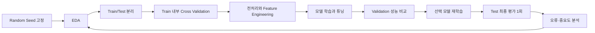

# DAY23 - 확률과 분류 모델 및 앙상블

> [!attention] 원문 제목 확인
> 전달받은 제목에는 `DAY22 (2026.09.07)`, 본문에는 `DAY 23`이라고 적혀 있다. 날짜와 수업 순서를 기준으로 이 노트는 **DAY23**으로 정리했다.

> [!tip] 한 문장 요약
> 분류 모델은 확률이나 결정 경계를 학습하고, 검증 데이터로 모델을 선택한 뒤 Test 데이터에서 마지막 성능을 확인한다.

> [!example] 비유
> 여러 의사가 각자 진단하게 한 뒤 투표하는 것이 Bagging이라면, 앞 의사의 오진 원인을 다음 의사가 차례로 보완하는 것이 Boosting이다.

## 📌 선수 지식

| 필요한 개념 | 왜 필요한가? | 관련 노트 |
|---|---|---|
| Train·Validation·Test 분리 | 모델 선택과 최종 평가를 분리하기 위해 | [[DAY20 - 머신러닝 워크플로우와 데이터 누수]] |
| 인코딩과 스케일링 | Logistic Regression과 SVM의 입력을 준비하기 위해 | [[DAY21 - 인코딩과 스케일링 및 모델 평가]] |
| 분류 평가 지표 | Accuracy만으로 놓치는 오류를 확인하기 위해 | [[DAY22 - 선형 회귀와 경사하강법 및 분류 평가]] |
| Titanic EDA | Feature Engineering의 근거를 찾기 위해 | [[Seaborn Titanic 데이터로 EDA 연습하기]] |

## 🎯 학습 목표

- [ ] Probability와 Likelihood가 무엇을 고정하는지 설명할 수 있다.
- [ ] MLE가 가능도를 최대화하는 Parameter를 찾는 과정임을 설명할 수 있다.
- [ ] Sigmoid, Softmax, Log Loss의 역할을 구분할 수 있다.
- [ ] SVM의 Margin과 `C`의 관계를 설명할 수 있다.
- [ ] Decision Tree의 불순도와 주요 Hyperparameter를 설명할 수 있다.
- [ ] Bagging과 Boosting의 학습 방식을 비교할 수 있다.
- [ ] Test Leakage 없이 Cross Validation으로 모델을 선택할 수 있다.

## 1단계 · 핵심 개념

### 1. Probability, Likelihood, MLE

확률은 **모델의 Parameter를 고정**하고 앞으로 어떤 데이터가 나올지를 계산한다. 가능도는 **관측 데이터를 고정**하고 어떤 Parameter가 그 데이터를 더 잘 설명하는지 비교한다.

```text
Probability : 고정된 모델 → 나올 데이터의 가능성
Likelihood  : 관측된 데이터 → 모델 Parameter의 타당성 비교
```

동전을 10번 던져 앞면이 9번 나왔다면, Probability 관점에서는 앞면 확률 `p`가 정해졌을 때 이런 결과가 나올 확률을 계산한다. Likelihood 관점에서는 결과를 고정하고 `p=0.5`, `0.8`, `0.9` 중 어느 값이 데이터를 가장 잘 설명하는지 비교한다.

```math
\hat{\theta}_{MLE} = \arg\max_{\theta} L(\theta)
```

> [!note] 주의
> Likelihood는 Parameter에 대한 확률분포가 아니다. 관측 데이터가 주어졌을 때 Parameter 값들을 비교하는 함수다.

### 2. Logistic Regression과 확률 함수

Logistic Regression은 이름과 달리 대표적인 **분류 알고리즘**이다. 선형 결합 `z = wx + b`를 Sigmoid에 통과시켜 이진 Class의 확률을 만든다.

```math
\sigma(z) = \frac{1}{1 + e^{-z}}
```

```python
import numpy as np

def sigmoid(x):
    return 1 / (1 + np.exp(-x))

print(sigmoid(-10))  # 약 0.000045
print(sigmoid(0))    # 0.5
print(sigmoid(10))   # 약 0.999955
```

서로 배타적인 Class가 3개 이상이면 주로 Softmax를 사용한다. Softmax 출력은 각 Class의 확률이며 전체 합은 1이다.

| 구분 | Sigmoid | Softmax |
|---|---|---|
| 대표 용도 | 이진분류, Multi-label | 단일 정답 다중분류 |
| 출력 관계 | 각 출력이 독립적일 수 있음 | 모든 Class 확률의 합이 1 |
| 예 | 생존/사망 | 고양이/개/새 중 하나 |

분류 손실함수인 Binary Cross Entropy, 즉 Log Loss는 정답 확률을 높이도록 모델을 학습시킨다.

```math
L = -\left[y\log(p) + (1-y)\log(1-p)\right]
```

틀린 답에 높은 확률을 부여할수록 손실이 매우 커진다. 따라서 같은 Accuracy라도 확률 예측의 품질을 구분할 수 있다.

### 3. SVM과 거리

SVM은 두 Class를 나누는 결정 경계와 가장 가까운 데이터인 **Support Vector** 사이의 거리, 즉 Margin을 최대화한다.

| `C` 값 | 규제 | 일반적인 경향 |
|---|---|---|
| 작음 | 강함 | 더 넓은 Margin, 일부 오분류 허용 |
| 큼 | 약함 | Train 오류를 더 강하게 줄임, 복잡한 경계 가능 |

거리의 대표적인 두 정의는 다음과 같다.

```math
d_{euclidean}=\sqrt{\sum_i(x_i-y_i)^2}
```

```math
d_{manhattan}=\sum_i|x_i-y_i|
```

거리와 Margin에 Feature 크기가 영향을 주므로 SVM을 사용할 때는 보통 Scaling이 중요하다.

### 4. Decision Tree와 불순도

Decision Tree는 질문으로 데이터를 반복해서 나눈다. 분할 후 같은 Class끼리 잘 모이도록 **가중 불순도 감소량**이 큰 조건을 선택한다.

```math
Gini = 1 - \sum_k p_k^2
```

```math
Entropy = -\sum_k p_k\log_2 p_k
```

두 지표 모두 작을수록 Node가 순수하다. Tree는 입력 Feature의 크기 자체보다 분할 순서를 사용하므로 일반적으로 Scaling이 필요하지 않다.

| Hyperparameter | 역할 |
|---|---|
| `max_depth` | Tree의 최대 깊이 제한 |
| `max_leaf_nodes` | Leaf Node 수 제한 |
| `min_samples_split` | Node 분할에 필요한 최소 Sample 수 |
| `min_samples_leaf` | Leaf에 남아야 하는 최소 Sample 수 |
| `max_features` | 분할 시 고려할 Feature 수 제한 |

`feature_importances_`는 모델이 분할 과정에서 어떤 Feature를 많이 활용했는지 탐색하는 단서다. 인과관계를 뜻하지 않으며, impurity 기반 중요도는 값의 종류가 많은 Feature를 선호할 수 있으므로 Permutation Importance 등과 함께 확인한다.

### 5. Ensemble

| 구분 | Bagging | Boosting |
|---|---|---|
| 학습 방식 | 여러 모델을 독립·병렬적으로 학습 | 앞 모델의 오류를 다음 모델이 순차 보완 |
| 핵심 효과 | 분산 감소 | 편향을 줄이며 강한 모델 구성 |
| 대표 모델 | Random Forest | XGBoost, LightGBM, CatBoost |

Random Forest는 Bootstrap Sample과 무작위 Feature 선택으로 Tree 간 상관을 낮춘 뒤 분류에서는 투표, 회귀에서는 평균으로 결과를 합친다.

| Boosting 모델 | 대표적인 성장·처리 특징 | 강점 |
|---|---|---|
| XGBoost | Level-wise 성향, 강한 규제 옵션 | 안정적인 성능과 풍부한 설정 |
| LightGBM | Leaf-wise 성장 | 빠른 학습과 대용량 데이터 처리 |
| CatBoost | Symmetric Tree, 범주형 Feature 지원 | 범주형 데이터 처리 편의성 |

## 2단계 · 전체 학습 흐름



전처리는 Fold마다 Train 부분에만 `fit`되어야 한다. Scikit-learn의 `Pipeline`과 Cross Validation을 함께 쓰면 Scaling이나 Imputation 정보가 Validation Fold로 새는 문제를 줄일 수 있다.

## 3단계 · 코드로 연결하기

### Test Leakage가 있는 예

아래 코드는 매번 Test 점수를 확인해 `C`를 선택하므로 Test가 사실상 Validation 역할을 하게 된다.

```python
best_score, best_hpo = 0.0, 0.0

for hpo in range(1, 50):
    logreg = LogisticRegression(C=hpo).fit(X_tr, y_tr)
    test_score = logreg.score(X_te, y_te)  # 반복 참조: leakage
    if best_score < test_score:
        best_score, best_hpo = test_score, hpo
```

### Pipeline과 Cross Validation 사용

```python
from sklearn.model_selection import GridSearchCV, train_test_split
from sklearn.pipeline import Pipeline
from sklearn.preprocessing import StandardScaler
from sklearn.linear_model import LogisticRegression

X_train, X_test, y_train, y_test = train_test_split(
    X, y,
    test_size=0.2,
    random_state=42,
    stratify=y
)

pipe = Pipeline([
    ("scaler", StandardScaler()),
    ("model", LogisticRegression(max_iter=1000, random_state=42))
])

search = GridSearchCV(
    pipe,
    param_grid={"model__C": [0.01, 0.1, 1, 10, 100]},
    scoring="accuracy",
    cv=5,
    n_jobs=-1
)

search.fit(X_train, y_train)
print(search.best_params_)
print(search.best_score_)

# 모델 선택이 모두 끝난 뒤 마지막에 한 번 평가
test_score = search.score(X_test, y_test)
print(test_score)
```

`stratify=y`는 Train과 Test의 Class 비율을 원본과 비슷하게 유지한다. 불균형 데이터에서는 Accuracy 외에 Precision, Recall, F1, ROC-AUC도 함께 검토한다.

### Titanic Feature Engineering과 평가

```python
train["family_size"] = train["sibsp"] + train["parch"] + 1
test["family_size"] = test["sibsp"] + test["parch"] + 1
```

`+1`은 승객 본인을 포함한다. 이 Feature로 혼자 탑승했는지, 소규모 가족인지, 대규모 가족인지 구간화해 생존률을 비교할 수 있다.

```python
from sklearn.metrics import confusion_matrix
import seaborn as sns
import matplotlib.pyplot as plt

cm = confusion_matrix(y_test, y_pred, normalize="true")

sns.heatmap(
    cm,
    annot=True,
    fmt=".2f",
    cmap="Blues",
    xticklabels=["Predicted 0", "Predicted 1"],
    yticklabels=["Actual 0", "Actual 1"]
)
plt.xlabel("Predicted")
plt.ylabel("Actual")
plt.show()
```

`normalize="true"`는 실제 Class별 행의 합을 1로 만든다. 각 실제 Class가 어느 비율로 맞거나 틀렸는지 읽기 쉽다.

## 4단계 · 실습 과제

1. Breast Cancer 데이터에서 Logistic Regression과 SVM을 각각 Pipeline으로 구성한다.
2. `C=[0.01, 0.1, 1, 10, 100]`을 5-Fold Cross Validation으로 비교한다.
3. Decision Tree, Random Forest와 성능을 비교한다.
4. Confusion Matrix와 Classification Report로 FN과 FP를 분석한다.
5. Titanic 데이터에서 `family_size`를 만들고 생존률 변화를 시각화한다.
6. XGBoost, LightGBM, CatBoost를 같은 Fold와 평가 지표로 비교한다.

> [!warning] 공정한 비교 조건
> 같은 데이터 분할, 같은 Random Seed, 같은 평가 지표를 사용해야 모델 차이를 해석할 수 있다. 학습 시간도 비교하려면 같은 실행 환경에서 측정한다.

## 🛠️ 자주 생기는 문제

| 문제 | 원인 | 해결 방법 |
|---|---|---|
| Validation 점수는 높은데 Test 점수가 낮음 | Validation에 과적합 | 탐색 범위를 줄이고 Nested CV 또는 별도 Test로 확인 |
| SVM 성능이 불안정함 | Feature Scale 차이 | `StandardScaler`를 Pipeline에 포함 |
| Tree가 Train 데이터만 잘 맞춤 | 깊이와 Leaf 제한 부족 | `max_depth`, `min_samples_leaf` 등 조정 |
| Accuracy는 높은데 중요한 Class를 놓침 | Class 불균형 | Recall, F1, PR-AUC와 Confusion Matrix 확인 |
| CV 점수가 비정상적으로 높음 | 전처리를 전체 데이터에 먼저 적용 | Pipeline 안에서 전처리 수행 |
| Feature Importance를 원인으로 해석함 | 예측 기여와 인과관계 혼동 | EDA·도메인 지식·Permutation Importance로 교차 확인 |

## 🤖 ChatGPT 요약

### 오늘 배운 내용

- 관측 전에는 Probability, 관측 후 Parameter 비교에는 Likelihood 관점을 사용한다.
- Logistic Regression은 선형 결합을 Sigmoid에 통과시켜 이진분류 확률을 만든다.
- SVM은 Margin을 최대화하며, Decision Tree는 불순도를 줄이는 분할을 찾는다.
- Random Forest는 Bagging, XGBoost·LightGBM·CatBoost는 Boosting 계열의 대표 모델이다.
- 모델 선택은 Train 내부 Validation 또는 Cross Validation으로 하고 Test는 마지막에 평가한다.

### 핵심 3문장

1. MLE는 관측 데이터를 가장 잘 설명하는 Parameter를 찾는다.
2. 규제와 Tree 성장 제한은 모델이 Train 데이터를 외우는 것을 막는 핵심 장치다.
3. 평가 데이터의 역할을 분리해야 성능 추정치를 신뢰할 수 있다.

### 시험·면접 포인트

- Probability와 Likelihood의 차이는 무엇을 고정하는지로 설명한다.
- Logistic Regression의 `C`는 규제 강도의 역수이므로 작을수록 규제가 강하다.
- SVM의 `C`가 작으면 Margin 위반을 더 허용하며 넓은 Margin을 선호한다.
- Gini와 Entropy는 모두 낮을수록 Node가 순수하다.
- Bagging은 독립 모델을 결합하고 Boosting은 이전 오류를 순차적으로 보완한다.
- Hyperparameter 선택에 Test 데이터를 사용하면 Test Leakage가 발생한다.

### 개념 체크리스트

- [ ] Likelihood를 Parameter의 확률이라고 부르지 않는다.
- [ ] Sigmoid와 Softmax의 출력 관계를 구분한다.
- [ ] Scaling이 필요한 모델과 덜 민감한 Tree 모델을 구분한다.
- [ ] Tree 불순도 감소와 Feature Importance의 한계를 설명한다.
- [ ] Bagging과 Boosting의 학습 순서를 설명한다.

### 실수 방지 체크리스트

- [ ] Test 점수를 보며 Hyperparameter를 선택하지 않는다.
- [ ] 전처리를 데이터 분할이나 CV 전에 전체 데이터에 `fit`하지 않는다.
- [ ] 불균형 데이터에서 Accuracy만 보지 않는다.
- [ ] `random_state`와 평가 조건을 통일한다.
- [ ] `feature_importances_`를 인과관계로 해석하지 않는다.

### 미니 문제

1. 동전을 10번 던져 앞면 9번을 관측한 뒤 앞면 확률 `p`를 비교하는 관점은?
2. Logistic Regression에서 `C`가 작아지면 규제는 어떻게 변하는가?
3. SVM에서 결정 경계와 가장 가까운 데이터를 무엇이라 하는가?
4. Gini가 0인 Node는 어떤 상태인가?
5. Test 데이터를 마지막에 한 번만 사용해야 하는 이유는?

<details>
<summary>정답 확인</summary>

1. Likelihood 관점이다.
2. 규제가 강해진다.
3. Support Vector다.
4. 하나의 Class만 포함한 순수한 Node다.
5. 모델 선택 과정의 정보가 Test에 섞이는 Leakage를 막고 일반화 성능을 공정하게 추정하기 위해서다.

</details>

## 🤔💭 KPT

### 👍 Keep

- Probability와 Likelihood를 무엇을 고정하는지로 구분했다.
- Bagging과 Boosting, 주요 Boosting 모델의 차이를 표로 비교했다.

### 😂 Problem

- 모델별 Hyperparameter와 서로의 상호작용을 아직 충분히 체득하지 못했다.
- 실전에서 Validation Set과 Cross Validation을 구성하는 방법이 익숙하지 않다.

### 🔥 Try

- 오늘 배운 모델을 Pipeline과 Cross Validation으로 다시 실습한다.
- XGBoost, LightGBM, CatBoost를 같은 데이터와 조건에서 성능 및 학습 시간으로 비교한다.

## 🗓️ 복습 일정

- [ ] 1일 뒤: 2026-09-10 — 핵심 3문장과 미니 문제 복습
- [ ] 7일 뒤: 2026-09-16 — Leakage 없는 CV 코드를 직접 작성
- [ ] 30일 뒤: 2026-10-09 — 네 모델을 같은 데이터로 비교하고 오류 분석

## 🔗 관련 노트

- [[DAY20 - 머신러닝 워크플로우와 데이터 누수]]
- [[DAY21 - 인코딩과 스케일링 및 모델 평가]]
- [[DAY22 - 선형 회귀와 경사하강법 및 분류 평가]]
- [[Seaborn Titanic 데이터로 EDA 연습하기]]

