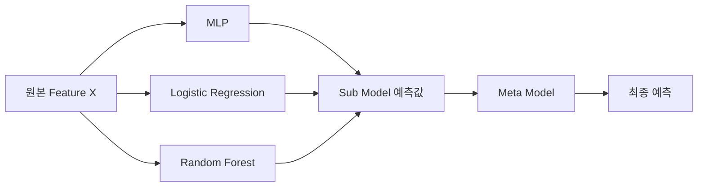
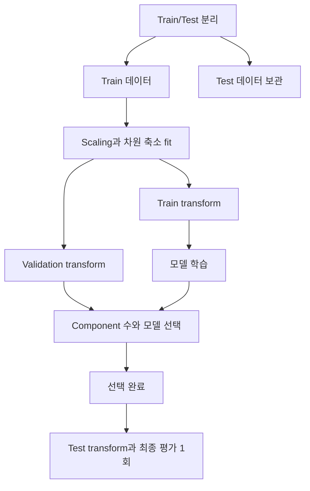

# DAY24 - Voting과 Stacking 및 차원 축소

[Velog 원문](https://velog.io/@doldolkoong/플레이데이터-SK네트웍스-Family-AI-캠프-36기-DAY23-2026.09.08) · 수업일 2026-09-08

> [!attention] 원문 표기
> 게시글 제목은 `DAY24`, URL과 본문 첫 줄은 `DAY23`으로 표기되어 있다. 수업 순서와 게시글 제목을 기준으로 이 노트는 **DAY24**로 정리했다.

> [!tip] 한 문장 요약
> 여러 모델의 예측을 Voting과 Stacking으로 결합하고, 고차원 데이터는 PCA·SVD·NMF로 핵심 구조를 남기면서 축소한다.

> [!example] 비유
> Voting은 여러 심사위원의 표나 점수를 합치는 방식이고, Stacking은 심사위원들의 판단 패턴을 최종 심사위원이 다시 학습하는 방식이다.

## 📌 선수 지식

| 필요한 개념 | 왜 필요한가? | 관련 노트 |
|---|---|---|
| 분류 모델과 확률 | Soft Voting의 예측 확률을 이해하기 위해 | [[DAY23 - 확률과 분류 모델 및 앙상블]] |
| Train·Test 분리 | 변환기의 `fit`과 `transform` 범위를 구분하기 위해 | [[DAY20 - 머신러닝 워크플로우와 데이터 누수]] |
| 인코딩과 스케일링 | 고차원 Sparse Matrix와 PCA 전처리를 이해하기 위해 | [[DAY21 - 인코딩과 스케일링 및 모델 평가]] |

## 🎯 학습 목표

- [ ] Hard Voting과 Soft Voting의 차이를 설명할 수 있다.
- [ ] Stacking에서 Sub Model과 Meta Model의 역할을 설명할 수 있다.
- [ ] 비지도학습과 지도학습을 Target 유무로 구분할 수 있다.
- [ ] 차원의 저주가 거리 기반 모델에 미치는 영향을 설명할 수 있다.
- [ ] PCA, Truncated SVD, NMF의 목적과 입력 조건을 비교할 수 있다.
- [ ] 차원 축소 과정에서 Data Leakage를 방지할 수 있다.

## 1단계 · 앙상블: Voting과 Stacking

앙상블은 서로 다른 모델의 판단을 결합해 단일 모델보다 안정적이거나 강한 예측기를 만드는 방법이다. 모델들이 서로 다른 오류를 낼 때 결합 효과가 커진다.

### Voting

| 방식 | 최종 결정 | 필요한 조건 |
|---|---|---|
| Hard Voting | 각 모델이 예측한 Class의 다수결 | `predict()` 결과 |
| Soft Voting | 각 Class의 예측 확률을 평균한 뒤 최대값 선택 | 모든 모델의 `predict_proba()` 지원 |

```python
from sklearn.ensemble import VotingClassifier, RandomForestClassifier
from sklearn.neural_network import MLPClassifier
from sklearn.linear_model import LogisticRegression

SEED = 42

estimators = [
    ("mlp", MLPClassifier(max_iter=1000, random_state=SEED)),
    ("lr", LogisticRegression(random_state=SEED)),
    ("rf", RandomForestClassifier(random_state=SEED)),
]

vot = VotingClassifier(
    estimators=estimators,
    voting="soft"
).fit(X_tr, y_tr)

print(vot.score(X_tr, y_tr), vot.score(X_te, y_te))
```

원문 실험 결과는 다음과 같다.

| 방식 | Train Score | Test Score |
|---|---:|---:|
| Soft Voting | 0.9718 | 0.9580 |
| Hard Voting | 0.9671 | 0.9441 |

이 실험에서는 Soft Voting이 더 높았지만 항상 그런 것은 아니다. 확률 Calibration이 좋지 않은 모델이 섞이면 Soft Voting이 불리할 수도 있으므로 Cross Validation으로 비교해야 한다.

### Stacking

Stacking은 여러 Sub Model의 예측을 새로운 Feature로 만들고, Meta Model이 그 Feature를 학습해 최종 예측을 만든다.



```python
from sklearn.ensemble import StackingClassifier

stack = StackingClassifier(
    estimators=estimators,
    final_estimator=LogisticRegression(random_state=SEED),
    n_jobs=-1
).fit(X_tr, y_tr)

print(stack.score(X_tr, y_tr), stack.score(X_te, y_te))
```

> 원문 결과: Train `0.9836`, Test `0.9650`

Stacking이 세 방식 중 가장 높은 Test 점수를 보였다. 이 결과는 해당 데이터 분할에서 나온 값이므로 일반적인 우열로 단정하지 않는다. Scikit-learn의 `StackingClassifier`는 기본적으로 Cross Validation을 이용해 Meta Model 학습용 예측값을 만들기 때문에 같은 Sample을 학습하고 예측한 값을 그대로 Meta Model에 전달하는 누수를 줄인다.

## 2단계 · 비지도학습과 차원의 저주

### 비지도학습

지도학습은 Feature `X`와 정답 `y`를 함께 사용한다. 비지도학습은 Target 없이 `X` 내부의 구조와 패턴을 찾는다.

| 목적 | 대표 기법 | 결과 |
|---|---|---|
| 비슷한 Sample 묶기 | Clustering | Cluster Label 또는 중심점 |
| 분산이 큰 축 찾기 | PCA | Principal Component |
| 행렬의 잠재 구조 분해 | SVD | Singular Vector와 Value |
| 비음수 부분 구조 분해 | NMF | 비음수 행렬 `W`, `H` |

### 차원의 저주

머신러닝에서 차원은 주로 **Feature 개수**를 뜻한다. 차원이 커질수록 가능한 공간의 부피는 급격히 증가하지만 Sample 수가 그대로라면 데이터가 희박해진다. 이때 가까운 점과 먼 점의 거리 차이가 상대적으로 작아져 KNN 같은 거리 기반 모델이 이웃을 구분하기 어려워질 수 있다.

원문의 KNN 실험에서는 2개 Feature일 때와 연속형 Feature를 실험적으로 One-Hot Encoding해 52개로 늘렸을 때를 비교했다.

| 입력 차원 | Train Score | Test Score |
|---:|---:|---:|
| 2 | 0.9474 | 0.8571 |
| 52 | 0.8947 | 0.4286 |

```python
from sklearn.preprocessing import OneHotEncoder

enc = OneHotEncoder()
X_enc = enc.fit_transform(X)  # (26, 2) → (26, 52)
```

> [!warning] 실험 해석
> 연속형 수치를 One-Hot Encoding한 것은 차원 증가 효과를 보기 위한 실험이다. Test 점수 하락에는 고차원뿐 아니라 표현 방식 변화와 매우 작은 Sample 수도 함께 영향을 준다. 실무에서 연속형 Feature를 이 방식으로 처리하라는 의미는 아니다.

차원의 저주를 완화하는 방법에는 Sample 추가 수집, 불필요하거나 중복된 Feature 제거, Feature Selection, 차원 축소가 있다.

## 3단계 · PCA, SVD, NMF

차원 축소는 여러 원본 Feature를 결합해 더 적은 수의 새로운 Component로 표현한다. 원본 Feature 일부를 그대로 고르는 Feature Selection과 구분한다.

| 기법 | 핵심 목적 | Centering | 적합한 데이터 | 주요 주의점 |
|---|---|---|---|---|
| PCA | 분산이 큰 직교 방향 보존 | 수행 | Dense 연속형 데이터 | Scale에 민감 |
| Truncated SVD | 큰 특이값 중심으로 행렬 근사 | 수행하지 않음 | TF-IDF, One-Hot 등 Sparse Matrix | Component 해석 확인 |
| NMF | 비음수 부분 구조의 조합 | 해당 없음 | 빈도, 이미지 밝기 등 비음수 데이터 | 입력값이 음수면 안 됨 |

### PCA

PCA는 첫 번째 Component가 가장 큰 분산을 설명하고, 다음 Component는 이전 축과 직교하면서 남은 분산을 최대한 설명하도록 축을 만든다.

```python
from sklearn.decomposition import PCA
from sklearn.preprocessing import StandardScaler

pca_cols = ["pclass", "fare"]

scaler = StandardScaler()
X_scaled = scaler.fit_transform(train[pca_cols])

pca = PCA(n_components=1)
X_pca = pca.fit_transform(X_scaled)

print(pca.explained_variance_ratio_)
```

원문에서는 Scaling 없이 `pclass`, `fare`를 PCA에 넣었을 때 첫 Component의 설명 분산 비율이 `0.99979536`, 약 99.98%였다. 이는 두 Feature의 정보가 완벽하게 하나로 합쳐졌다는 뜻이 아니다. 값의 범위가 큰 `fare`의 분산이 결과를 지배했을 가능성이 크므로 PCA 전에는 보통 Scaling을 먼저 검토한다.

```python
train_pca = pd.DataFrame(
    pca.transform(train[pca_cols])
).add_prefix("pca_")

train_concat = pd.concat(
    [train[not_pca].reset_index(drop=True), train_pca],
    axis=1
)
```

원문 실습에서는 `pclass`, `fare` 두 Column을 `pca_0` 하나로 바꿔 `(604, 12)`에서 `(604, 11)`로 축소했다.

### Truncated SVD

SVD는 행렬을 다음과 같이 분해한다.

```math
A = U\Sigma V^T
```

Truncated SVD는 큰 특이값과 대응하는 Vector만 남겨 낮은 Rank의 행렬로 근사한다. 데이터를 Centering하지 않으므로 Sparse Matrix를 Sparse 상태로 처리할 수 있어 텍스트의 TF-IDF 등에 자주 사용한다.

```python
from sklearn.decomposition import TruncatedSVD

svd = TruncatedSVD(n_components=2, random_state=42)
X_train_svd = svd.fit_transform(X_train)
X_test_svd = svd.transform(X_test)
```

### NMF

NMF는 비음수 행렬을 두 비음수 행렬의 곱으로 근사한다.

```math
X \approx WH, \qquad X,W,H \ge 0
```

```python
from sklearn.decomposition import NMF

nmf = NMF(n_components=2, random_state=42, max_iter=1000)
X_train_nmf = nmf.fit_transform(X_train)
X_test_nmf = nmf.transform(X_test)
```

각 Component가 부분의 조합으로 해석되는 경우가 많아 문서의 주제나 이미지의 부분 패턴을 찾을 때 유용하다. `StandardScaler`는 음수를 만들 수 있으므로 NMF 앞에서 무조건 적용하면 안 된다. 데이터 의미에 맞는 비음수 Scaling이나 원래 비음수 표현을 사용해야 한다.

## 4단계 · 누수 없는 실전 흐름



```python
from sklearn.pipeline import Pipeline
from sklearn.model_selection import GridSearchCV
from sklearn.preprocessing import StandardScaler
from sklearn.decomposition import PCA
from sklearn.linear_model import LogisticRegression

pipe = Pipeline([
    ("scaler", StandardScaler()),
    ("pca", PCA()),
    ("model", LogisticRegression(max_iter=1000, random_state=42)),
])

search = GridSearchCV(
    pipe,
    param_grid={
        "pca__n_components": [2, 5, 10],
        "model__C": [0.1, 1, 10],
    },
    cv=5,
    scoring="accuracy",
    n_jobs=-1,
)

search.fit(X_train, y_train)
test_score = search.score(X_test, y_test)
```

Pipeline을 사용하면 각 Fold의 Train 부분에만 Scaling과 PCA가 `fit`된다. Test 데이터는 Train에서 학습한 변환기로 `transform()`만 해야 한다.

> [!important] 설명 분산과 모델 성능
> PCA는 Target `y`를 보지 않고 `X`의 분산을 보존한다. 설명 분산 비율이 높아도 분류에 중요한 작은 분산 방향이 사라질 수 있으므로 Component 수는 설명 분산 비율과 Cross Validation 성능을 함께 보고 정한다.

## 🛠️ 자주 생기는 문제

| 문제 | 원인 | 해결 방법 |
|---|---|---|
| Soft Voting이 기대보다 낮음 | 확률 Scale이나 Calibration 차이 | 개별 모델 확률 품질 확인, 가중치와 Calibration 검토 |
| Stacking 성능이 과도하게 높음 | Meta Model 입력 생성 과정의 누수 | Out-of-fold 예측을 사용하고 Pipeline으로 전처리 격리 |
| PCA 첫 Component 비율이 지나치게 큼 | Feature Scale 차이 | Train 데이터에 `StandardScaler`를 fit한 뒤 PCA 적용 |
| Validation은 높은데 Test가 낮음 | Component 수를 Validation에 과적합 | 탐색 범위 단순화, 반복 CV 또는 Nested CV 검토 |
| NMF에서 음수 입력 오류 | 전처리 결과에 음수 포함 | 입력 범위 확인, 비음수 표현 사용 |
| 차원 축소 후 해석이 어려움 | Component가 원본 Feature의 조합 | `components_`의 Loading과 대표 Sample 확인 |

## 🤖 ChatGPT 요약

### 오늘 배운 내용

- Voting은 Class 또는 확률을 합치고, Stacking은 Sub Model 예측을 Meta Model이 학습한다.
- 비지도학습은 Target 없이 Feature의 구조를 찾는다.
- 고차원에서는 데이터가 희박해지고 거리의 변별력이 약해질 수 있다.
- PCA는 분산, SVD는 특이값, NMF는 비음수 부분 구조를 중심으로 차원을 줄인다.
- 변환기는 Train에서만 `fit`하고 Validation과 Test에는 `transform`해야 한다.

### 핵심 3문장

1. Soft Voting은 예측 확률을 평균하고 Stacking은 예측 결과를 새 Feature로 학습한다.
2. PCA는 Scale에 민감하고, Truncated SVD는 Sparse Matrix에 적합하며, NMF는 비음수 입력이 필요하다.
3. 설명 분산 비율과 실제 모델 성능을 함께 확인해 Component 수를 선택한다.

### 시험·면접 포인트

- Hard Voting과 Soft Voting의 차이 및 Soft Voting의 조건
- Stacking의 Out-of-fold 예측이 필요한 이유
- 차원의 저주가 KNN에 미치는 영향
- PCA와 Truncated SVD의 Centering 차이
- NMF의 비음수 제약과 해석상의 장점
- PCA 전에 Scaling을 검토해야 하는 이유

### 개념 체크리스트

- [ ] Voting과 Stacking의 최종 결정 방식을 구분한다.
- [ ] 차원과 Feature 개수의 관계를 설명한다.
- [ ] PCA의 Component와 설명 분산 비율을 설명한다.
- [ ] PCA, SVD, NMF의 입력 데이터 조건을 구분한다.
- [ ] Feature Selection과 Feature Extraction을 구분한다.

### 실수 방지 체크리스트

- [ ] 전체 데이터에 Scaling이나 PCA를 먼저 `fit`하지 않는다.
- [ ] Test 데이터에 `fit_transform()`을 호출하지 않는다.
- [ ] PCA 설명 분산 비율만 보고 모델 성능을 단정하지 않는다.
- [ ] NMF 입력에 음수가 없는지 확인한다.
- [ ] 단일 Train/Test 분할 결과만으로 앙상블 우열을 일반화하지 않는다.

### 미니 문제

1. 각 모델의 예측 Class를 다수결로 합치는 방법은?
2. Stacking에서 Sub Model의 예측을 학습하는 모델은?
3. PCA 전에 Feature Scale을 맞추는 대표적인 이유는?
4. Sparse TF-IDF 행렬에 PCA보다 Truncated SVD가 편리한 이유는?
5. NMF 입력이 만족해야 할 조건은?

<details>
<summary>정답 확인</summary>

1. Hard Voting이다.
2. Meta Model 또는 Final Estimator다.
3. 값의 범위가 큰 Feature가 분산을 지배하는 것을 줄이기 위해서다.
4. Truncated SVD는 Centering 없이 Sparse Matrix를 직접 처리할 수 있기 때문이다.
5. 모든 입력값이 0 이상이어야 한다.

</details>

## 🤔💭 KPT

### 👍 Keep

- Voting과 Stacking을 코드로 비교하고 결과가 달라진 이유를 생각했다.
- PCA 설명 분산 비율 99.98%를 Scale 문제와 연결해 해석했다.

### 😂 Problem

- Eigenvector, Eigenvalue, Covariance Matrix가 아직 직관적으로 와닿지 않는다.
- PCA, SVD, NMF를 어떤 데이터에 선택해야 하는지 헷갈린다.

### 🔥 Try

- 실제 프로젝트 데이터에서 Component 수에 따른 Cross Validation 성능을 비교한다.
- Covariance, Eigenvector, Eigenvalue를 별도 노트로 정리한다.
- 동일한 데이터 표현에서 PCA, SVD, NMF의 복원 오차와 모델 성능을 비교한다.

## 🗓️ 복습 일정

- [ ] 1일 뒤: 2026-09-12 — Voting·Stacking과 PCA·SVD·NMF 비교표 복습
- [ ] 7일 뒤: 2026-09-18 — Pipeline으로 누수 없는 PCA 실습
- [ ] 30일 뒤: 2026-10-11 — Component 수별 성능 비교 및 KPT 갱신

## 🔗 관련 노트

- [[DAY20 - 머신러닝 워크플로우와 데이터 누수]]
- [[DAY21 - 인코딩과 스케일링 및 모델 평가]]
- [[DAY23 - 확률과 분류 모델 및 앙상블]]
- [[Seaborn Titanic 데이터로 EDA 연습하기]]

