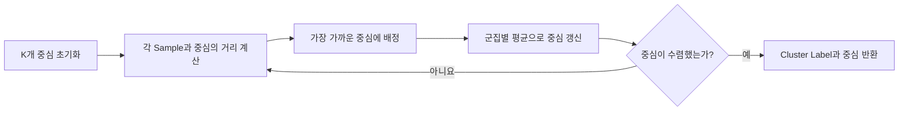
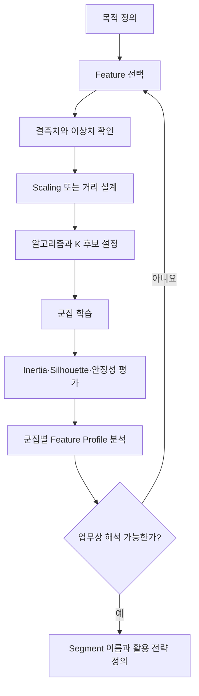

# DAY25 - K-Means와 군집 평가 및 계층적 군집

[Velog 원문](https://velog.io/@doldolkoong/플레이데이터-SK네트웍스-Family-AI-캠프-36기-DAY23-2026.09.09) · 수업일 2026-09-09

> [!attention] 원문 표기
> 게시글 제목은 `DAY25`, URL과 본문 내부에는 `DAY23`이 남아 있다. 수업 순서와 게시글 제목을 기준으로 **DAY25**로 정리했다.

> [!tip] 한 문장 요약
> 군집화는 정답 없이 데이터의 구조를 찾으며, K-Means에서는 Scaling·초기 중심·K 선택과 군집별 해석이 결과만큼 중요하다.

> [!example] 비유
> 운동장에 흩어진 사람들에게 임시 깃발 K개를 세운 뒤 가까운 깃발로 모이게 하고, 각 무리의 한가운데로 깃발을 옮기는 일을 반복하는 것이 K-Means다.

## 📌 선수 지식

| 필요한 개념 | 왜 필요한가? | 관련 노트 |
|---|---|---|
| 지도학습과 비지도학습 | Classification과 Clustering을 구분하기 위해 | [[DAY24 - Voting과 Stacking 및 차원 축소]] |
| Euclidean Distance | K-Means의 배정 기준을 이해하기 위해 | [[DAY23 - 확률과 분류 모델 및 앙상블]] |
| Scaling과 Data Leakage | 거리 왜곡과 변환 과정의 누수를 방지하기 위해 | [[DAY21 - 인코딩과 스케일링 및 모델 평가]] |
| Titanic EDA | 군집을 승객 특성과 연결해 해석하기 위해 | [[Seaborn Titanic 데이터로 EDA 연습하기]] |

## 🎯 학습 목표

- [ ] Classification과 Clustering을 Target 유무로 구분할 수 있다.
- [ ] K-Means의 배정과 중심 갱신 과정을 설명할 수 있다.
- [ ] K-Means에서 Scaling과 이상치 처리가 중요한 이유를 설명할 수 있다.
- [ ] Inertia, Elbow Method, Silhouette Score를 이용해 K 후보를 찾을 수 있다.
- [ ] K-Means와 MiniBatchKMeans, Agglomerative Clustering을 비교할 수 있다.
- [ ] Cluster 번호에 의미를 임의로 부여하지 않고 Feature 통계로 해석할 수 있다.

## 1단계 · Titanic 경진대회와 학습 유형

Titanic 경진대회에서는 Train 데이터에 정답 `survived`가 있고 Test 데이터에는 없다. Train에서 생존 패턴을 학습한 뒤 Test의 생존 여부를 예측하여 `passengerid`, `survived` 형태로 제출한다.

```text
Train: Feature + survived → 분류 모델 학습
Test : Feature            → survived 예측
제출 : passengerid + survived
```

| 구분 | Classification | Clustering |
|---|---|---|
| 학습 유형 | 지도학습 | 비지도학습 |
| Target | 있음 | 없음 |
| 목표 | 알려진 Class 예측 | 유사한 Sample의 구조 발견 |
| Titanic 예 | 생존 0/1 예측 | 유사한 승객 유형 탐색 |

Titanic 생존 예측은 Classification 문제다. Clustering을 사용한다면 `survived`를 제외한 Feature로 군집을 만든 뒤, 군집 해석 단계에서 생존률을 비교할 수 있다.

## 2단계 · K-Means 원리

K-Means는 K개의 중심점인 Centroid를 두고 각 Sample을 가장 가까운 중심에 배정한다. 배정된 Sample들의 평균으로 중심을 갱신하며 변화가 충분히 작아질 때까지 반복한다.



일반적으로 사용하는 Euclidean Distance는 다음과 같다.

```math
d(x,c)=\sqrt{\sum_{j=1}^{p}(x_j-c_j)^2}
```

K-Means가 최소화하는 목적함수는 각 Sample과 소속 Centroid 사이의 거리 제곱합이다.

```math
J=\sum_{k=1}^{K}\sum_{x_i\in C_k}\lVert x_i-\mu_k\rVert^2
```

### 기본 실습

```python
from sklearn.datasets import make_blobs
from sklearn.cluster import KMeans
import pandas as pd
import matplotlib.pyplot as plt

X, y = make_blobs(
    n_samples=300,
    centers=3,
    random_state=42
)

kmeans = KMeans(
    n_clusters=3,
    init="k-means++",
    random_state=42
)

labels = kmeans.fit_predict(X)  # y는 학습에 사용하지 않음

df_cluster = pd.DataFrame(X, columns=["x1", "x2"])
df_cluster["cluster"] = labels

plt.figure(figsize=(8, 6))
plt.scatter(X[:, 0], X[:, 1], c=labels)
plt.scatter(
    kmeans.cluster_centers_[:, 0],
    kmeans.cluster_centers_[:, 1],
    s=200,
    marker="X"
)
plt.xlabel("Feature 1")
plt.ylabel("Feature 2")
plt.title("K-Means Clustering")
plt.show()
```

`make_blobs()`가 연습용 정답 `y`를 만들지만 K-Means 학습에는 `X`만 사용한다. `labels_`의 0, 1, 2는 모델이 붙인 식별자일 뿐 순위나 좋고 나쁨을 뜻하지 않는다.

## 3단계 · Scaling, 초기화, 이상치

### Scaling

K-Means는 거리 기반이므로 숫자 범위가 큰 Feature가 거리를 지배한다. `age`가 수십 단위이고 `income`이 수천만 단위라면 Scaling 전 거리는 거의 `income` 차이로 결정될 수 있다.

```python
from sklearn.preprocessing import StandardScaler
from sklearn.cluster import KMeans
from sklearn.pipeline import Pipeline

pipe = Pipeline([
    ("scaler", StandardScaler()),
    ("kmeans", KMeans(
        n_clusters=3,
        init="k-means++",
        random_state=42
    )),
])

labels = pipe.fit_predict(X)
```

Scaling이 항상 정답은 아니다. Feature 단위와 업무 의미상 가중치가 중요한 경우에는 어떤 거리와 변환이 적절한지 먼저 결정한다.

### K-Means++

초기 중심이 서로 가까우면 좋지 않은 Local Optimum에 수렴할 수 있다. K-Means++는 이미 선택한 중심에서 멀리 떨어진 점이 다음 중심으로 선택될 가능성을 높여 초기 중심을 분산시킨다. `random_state`는 같은 실험을 재현하는 데 사용한다.

### 이상치와 군집 모양

Centroid는 평균이므로 이상치에 민감하다. 또한 거리와 평균을 이용하는 구조 때문에 대략 구형이고 크기와 밀도가 비슷한 군집을 잘 찾는다. 길쭉한 모양, 도넛 모양, 밀도가 크게 다른 군집에서는 실제 구조와 다른 결과가 나올 수 있다.

## 4단계 · K 선택과 군집 타당성 평가

좋은 군집은 같은 군집 안의 Sample은 가깝고, 서로 다른 군집은 멀리 떨어져 있어야 한다.

### Inertia와 Elbow Method

Inertia는 각 Sample과 소속 Centroid 사이의 거리 제곱합이다. 작을수록 군집 내부가 조밀하지만 K가 커질수록 거의 항상 감소하므로 최소값만 보고 K를 정하면 안 된다.

```python
inertias = []

for k in range(1, 11):
    model = KMeans(n_clusters=k, random_state=42)
    model.fit(X)
    inertias.append(model.inertia_)

plt.plot(range(1, 11), inertias, marker="o")
plt.xlabel("Number of Clusters K")
plt.ylabel("Inertia")
plt.title("Elbow Method")
plt.show()
```

그래프가 급격히 감소하다 완만해지는 팔꿈치 지점을 K 후보로 선택한다. 팔꿈치가 항상 선명하게 나타나는 것은 아니다.

### Silhouette Score

Sample `i`에 대해 `a(i)`는 같은 군집 내 평균 거리, `b(i)`는 가장 가까운 다른 군집까지의 평균 거리다.

```math
s(i)=\frac{b(i)-a(i)}{\max(a(i),b(i))}
```

| 값 | 일반적인 해석 |
|---:|---|
| 1에 가까움 | 자기 군집에는 가깝고 다른 군집과 잘 분리됨 |
| 0 근처 | 군집 경계가 겹치거나 애매함 |
| -1에 가까움 | 다른 군집에 더 가까울 가능성 |

```python
from sklearn.metrics import silhouette_score

scores = []
for k in range(2, 11):  # K=1은 Silhouette 계산 불가
    model = KMeans(n_clusters=k, random_state=42)
    labels = model.fit_predict(X)
    score = silhouette_score(X, labels)
    scores.append(score)
    print(f"K={k} / Silhouette={score:.4f}")
```

원문의 예시 결과에서는 `K=2: 0.70`, `K=3: 0.84`, `K=4: 0.67`, `K=5: 0.55`로 K=3이 유력한 후보였다.

> [!important] 최종 K 선택
> Elbow와 Silhouette는 후보를 좁히는 도구다. 도메인 지식, 군집의 안정성, 해석 가능성, 실제 운영 가능한 Segment 수까지 함께 고려한다.

## 5단계 · MiniBatchKMeans와 Agglomerative Clustering

### MiniBatchKMeans

MiniBatchKMeans는 전체 Sample 대신 작은 Batch로 Centroid를 갱신한다. 대규모 데이터에서 속도와 메모리 사용량을 개선하지만 일반 K-Means와 결과가 조금 다를 수 있다.

```python
from sklearn.cluster import MiniBatchKMeans

mini_kmeans = MiniBatchKMeans(
    n_clusters=3,
    batch_size=100,
    random_state=42
)

labels = mini_kmeans.fit_predict(X)
```

### Agglomerative Clustering

Agglomerative Clustering은 각 Sample을 하나의 군집으로 시작해 가까운 군집을 차례로 합친다. 작은 군집이 더 큰 군집으로 병합되는 계층 구조를 Dendrogram으로 표현할 수 있다.

```text
A B C D E F
→ AB C D E F
→ AB CD E F
→ AB CD EF
```

```python
from sklearn.cluster import AgglomerativeClustering

model = AgglomerativeClustering(n_clusters=3)
labels = model.fit_predict(X)
```

| 알고리즘 | 시작과 진행 | 장점 | 한계 |
|---|---|---|---|
| K-Means | K개 중심에서 배정·갱신 | 빠르고 단순함 | K 지정, Scale·이상치·모양에 민감 |
| MiniBatchKMeans | 작은 Batch로 중심 갱신 | 대용량 데이터에 빠름 | 근사 결과로 정확도가 달라질 수 있음 |
| Agglomerative | 개별 Sample부터 가까운 군집 병합 | 계층 구조 확인 가능 | Sample이 많으면 계산량과 메모리 부담 증가 |

Agglomerative Clustering에서는 군집 간 거리를 정의하는 `linkage` 선택도 결과에 영향을 준다. 군집 수뿐 아니라 Dendrogram과 Feature 특성을 함께 확인한다.

## 6단계 · 군집 결과 해석

군집 Label을 만드는 것은 분석의 시작이다. 군집별 Feature 분포와 업무 의미를 확인해야 활용 가능한 Segment가 된다.

```python
profile = (
    df.groupby("cluster")
      [["age", "income", "purchase"]]
      .agg(["count", "mean", "median"])
)

print(profile)
```

```text
Cluster 0 → 젊고 소득과 구매량이 낮은 집단
Cluster 1 → 중장년이며 소득과 구매량이 높은 집단
Cluster 2 → 여러 지표가 중간인 집단
```

통계를 확인한 뒤 `신규·저활동 고객`, `핵심 VIP 고객`, `일반 고객`처럼 업무 목적에 맞는 이름을 붙인다. Cluster 번호 자체에는 의미가 없으며 재학습하면 번호가 바뀔 수도 있다.

### Titanic에서 군집 활용

```python
cluster_features = ["age", "fare", "pclass", "family_size"]

# survived를 제외한 Feature로 군집 생성
train["cluster"] = cluster_pipe.fit_predict(train[cluster_features])

# 군집 생성 후 해석 단계에서 생존률 확인
cluster_summary = train.groupby("cluster").agg(
    passengers=("survived", "size"),
    survival_rate=("survived", "mean"),
    age_mean=("age", "mean"),
    fare_mean=("fare", "mean")
)
```

`survived`는 군집을 만드는 입력이 아니다. 생성된 군집이 어떤 승객 유형인지 사후에 해석하기 위한 외부 정보로 사용한다.

## 7단계 · 전체 실무 흐름



## 🛠️ 자주 생기는 문제

| 문제 | 원인 | 해결 방법 |
|---|---|---|
| 특정 Feature만 군집을 결정함 | Feature Scale 차이 | 단위와 의미 확인 후 Scaling 적용 |
| 실행할 때마다 Label이 달라짐 | 초기 중심과 Label 번호의 임의성 | `random_state` 고정, Feature Profile로 군집 대응 |
| Inertia가 가장 작은 큰 K를 선택함 | Inertia의 단조 감소 특성 간과 | Elbow, Silhouette, 활용 목적을 함께 확인 |
| Silhouette는 높은데 쓸 수 없는 군집임 | 수학적 분리만 평가 | 크기, 안정성, 해석 가능성과 운영 제약 검토 |
| Centroid가 데이터 중심과 동떨어짐 | 이상치 영향 | 이상치 분석, Robust Scaling 또는 다른 알고리즘 검토 |
| Titanic 군집을 생존 예측 정답으로 취급함 | 군집 Label과 Target 혼동 | 군집은 승객 유형, `survived`는 분류 Target으로 분리 |

## 🤖 ChatGPT 요약

### 오늘 배운 내용

- Clustering은 Target 없이 유사한 Sample의 구조를 찾는 비지도학습이다.
- K-Means는 배정과 평균 중심 갱신을 수렴할 때까지 반복한다.
- Scaling, 초기 중심, 이상치, 군집 모양이 결과에 영향을 준다.
- Elbow와 Silhouette를 함께 사용해 K 후보를 정한다.
- MiniBatchKMeans는 속도를 높이고 Agglomerative Clustering은 계층 구조를 제공한다.
- 최종 단계에서는 군집별 Feature 통계로 의미를 해석한다.

### 핵심 3문장

1. K-Means는 군집 내 거리 제곱합을 줄이는 방향으로 Centroid와 소속을 반복 갱신한다.
2. 좋은 K는 지표 하나의 최댓값이 아니라 분리도·안정성·해석 가능성·운영 목적을 함께 보고 정한다.
3. Cluster 번호는 이름표일 뿐이며 Feature Profile을 분석한 뒤 의미를 부여한다.

### 시험·면접 포인트

- Classification과 Clustering의 Target 유무
- K-Means의 Assignment와 Update 단계
- K-Means++가 초기 중심 문제를 완화하는 방식
- Inertia가 K 증가에 따라 감소하는 이유
- Silhouette Score의 범위와 `a(i)`, `b(i)` 의미
- K-Means와 Agglomerative Clustering의 차이

### 개념 체크리스트

- [ ] K-Means의 목적함수를 설명할 수 있다.
- [ ] Scaling 전후 거리 차이를 설명할 수 있다.
- [ ] Elbow와 Silhouette의 한계를 설명할 수 있다.
- [ ] MiniBatch와 Agglomerative 방식의 차이를 설명할 수 있다.
- [ ] 군집 결과를 Feature 통계로 Profile할 수 있다.

### 실수 방지 체크리스트

- [ ] 연습 데이터의 `y`를 K-Means 학습에 넣지 않는다.
- [ ] Cluster 0, 1, 2를 순위로 해석하지 않는다.
- [ ] Inertia가 가장 작은 K를 자동 선택하지 않는다.
- [ ] 이상치와 Feature Scale을 확인한다.
- [ ] Titanic 군집을 생존 정답으로 해석하지 않는다.

### 미니 문제

1. K-Means에서 `K`와 `Means`는 각각 무엇을 뜻하는가?
2. Feature Scale이 크게 다르면 K-Means 결과가 왜 왜곡되는가?
3. Inertia가 K가 커질수록 감소하는 이유는?
4. Silhouette Score가 0 근처라면 무엇을 의미하는가?
5. Agglomerative Clustering은 어떤 상태에서 시작하는가?

<details>
<summary>정답 확인</summary>

1. K는 군집 수, Means는 군집별 평균 위치인 Centroid를 뜻한다.
2. 큰 숫자 범위를 가진 Feature가 Euclidean Distance를 지배하기 때문이다.
3. 군집을 더 잘게 나누면 각 Sample과 가장 가까운 중심 사이의 거리가 자연스럽게 줄기 때문이다.
4. Sample이 군집 경계에 있거나 군집들이 서로 겹쳐 분리가 애매함을 뜻한다.
5. 각 Sample이 하나의 독립된 군집인 상태에서 시작한다.

</details>

## 🤔💭 KPT

### 👍 Keep

- K-Means의 중심 생성, 배정, 평균 계산, 재배정 흐름을 단계별로 정리했다.
- Inertia와 Silhouette를 도메인 지식 및 군집 해석과 함께 사용해야 함을 이해했다.

### 😂 Problem

- 데이터마다 적절한 K와 군집 알고리즘을 선택하는 기준이 아직 익숙하지 않다.
- 지표가 좋은 군집과 실제 업무에서 유용한 군집을 연결하는 연습이 더 필요하다.

### 🔥 Try

- Titanic 승객을 군집화하고 군집별 `age`, `fare`, `pclass`, `family_size`, 생존률을 비교한다.
- K=2~10에서 Inertia와 Silhouette를 한 그래프로 비교한다.
- 같은 데이터에 K-Means와 Agglomerative Clustering을 적용해 군집 Profile의 안정성을 비교한다.

## 🗓️ 복습 일정

- [ ] 1일 뒤: 2026-09-12 — K-Means 동작 단계와 평가 지표 복습
- [ ] 7일 뒤: 2026-09-18 — Elbow·Silhouette 및 Titanic 군집 실습
- [ ] 30일 뒤: 2026-10-11 — 세 군집 알고리즘의 결과와 안정성 비교

## 🔗 관련 노트

- [[DAY21 - 인코딩과 스케일링 및 모델 평가]]
- [[DAY23 - 확률과 분류 모델 및 앙상블]]
- [[DAY24 - Voting과 Stacking 및 차원 축소]]
- [[Seaborn Titanic 데이터로 EDA 연습하기]]

