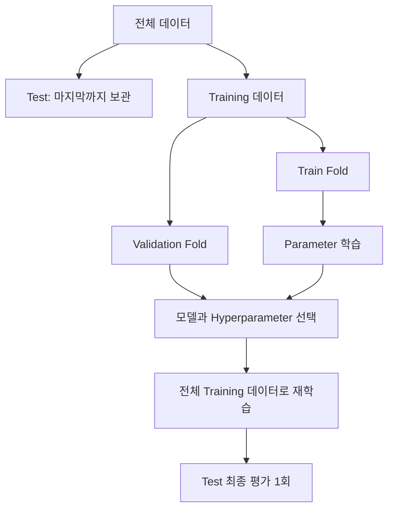
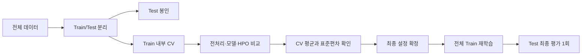

# DAY26 - 일반화와 교차검증 및 데이터 누수

[Velog 원문](https://velog.io/@doldolkoong/플레이데이터-SK네트웍스-Family-AI-캠프-36기-DAY24-2026.09.10) · 수업일 2026-09-10

> [!attention] 원문 표기
> 게시글 제목은 `DAY26`, URL과 본문 내부에는 `DAY24`가 남아 있다. 수업 순서와 게시글 제목을 기준으로 **DAY26**으로 정리했다.

> [!tip] 한 문장 요약
> Test 데이터는 마지막까지 보관하고, Train 내부 Cross Validation으로 모델과 Hyperparameter를 선택해야 일반화 성능을 공정하게 추정할 수 있다.

> [!example] 비유
> Train은 문제집, Validation은 여러 번 보는 모의고사, Test는 개발이 끝난 뒤 한 번만 보는 최종시험이다.

## 📌 선수 지식

| 필요한 개념 | 왜 필요한가? | 관련 노트 |
|---|---|---|
| 머신러닝 전체 흐름 | 데이터 분리와 평가 단계를 이해하기 위해 | [[DAY20 - 머신러닝 워크플로우와 데이터 누수]] |
| 전처리와 Scaling | Pipeline이 막아야 하는 Leakage를 이해하기 위해 | [[DAY21 - 인코딩과 스케일링 및 모델 평가]] |
| 분류 평가 | Fold별 Accuracy 외 지표를 선택하기 위해 | [[DAY22 - 선형 회귀와 경사하강법 및 분류 평가]] |
| Hyperparameter와 규제 | CV로 모델 복잡도를 선택하기 위해 | [[DAY23 - 확률과 분류 모델 및 앙상블]] |

## 🎯 학습 목표

- [ ] Generalization, Overfitting, Underfitting을 성능 Gap으로 설명할 수 있다.
- [ ] Train, Validation, Test의 역할을 구분할 수 있다.
- [ ] Cross Validation의 동작 방식과 장단점을 설명할 수 있다.
- [ ] KFold와 StratifiedKFold를 문제 유형에 맞게 선택할 수 있다.
- [ ] `cross_val_score`, `cross_val_predict`, `cross_validate`를 구분할 수 있다.
- [ ] Pipeline으로 전처리 Leakage를 방지할 수 있다.

## 1단계 · 모델의 목표는 일반화

머신러닝의 목표는 Train 데이터를 외우는 것이 아니라 학습 중 보지 못한 데이터에서도 좋은 예측을 하는 것이다. 이 능력을 **Generalization**이라고 한다.

| 상태 | Train 성능 | Validation 성능 | 해석 |
|---|---:|---:|---|
| Underfitting | 낮음 | 낮음 | 모델이 기본 패턴도 충분히 학습하지 못함 |
| Good Fit | 높음 | 높음 | 새 데이터에서도 배운 규칙이 유지됨 |
| Overfitting | 매우 높음 | 상대적으로 낮음 | Train의 세부 Noise까지 학습했을 가능성 |

```text
Overfitting 예시 : Train Accuracy 0.99 / Validation Accuracy 0.75
Underfitting 예시: Train Accuracy 0.65 / Validation Accuracy 0.62
```

Accuracy는 높을수록 좋지만 Error와 Loss는 낮을수록 좋다. Overfitting에서는 Train Error가 매우 작고 Validation Error가 상대적으로 커진다.

> [!note] 점수 Gap의 해석
> Train 점수가 높다는 사실만으로 Overfitting이라고 단정하지 않는다. Train과 Validation이 모두 높고 차이도 작다면 일반화가 잘 된 모델일 수 있다.

## 2단계 · Train, Validation, Test 역할

| 데이터 | 역할 | 사용 시점 |
|---|---|---|
| Train | 모델 Parameter 학습 | `fit()` |
| Validation | 모델·Feature·Hyperparameter 선택 | 개발 중 반복 평가 |
| Test | 최종 일반화 성능 추정 | 모든 선택이 끝난 뒤 1회 |



Test 점수를 보고 모델, Feature, Hyperparameter를 계속 바꾸면 사람이 Test 정보에 맞춰 의사결정을 하게 된다. `fit(X_test, y_test)`를 호출하지 않았더라도 Test가 개발 과정에 사용되므로 최종 성능 추정이 낙관적으로 변할 수 있다.

## 3단계 · Cross Validation

K-Fold Cross Validation은 Training 데이터를 K개 Fold로 나눈다. 각 반복에서 한 Fold를 Validation으로, 나머지를 Train으로 사용하여 모든 Fold가 한 번씩 Validation 역할을 맡게 한다.

```text
1회차: Valid=F1 / Train=F2,F3,F4,F5
2회차: Valid=F2 / Train=F1,F3,F4,F5
3회차: Valid=F3 / Train=F1,F2,F4,F5
4회차: Valid=F4 / Train=F1,F2,F3,F5
5회차: Valid=F5 / Train=F1,F2,F3,F4
```

### 장점

- 모든 Training Sample이 학습과 검증에 참여한다.
- 한 번의 Validation Split에 따른 우연을 줄인다.
- Fold 평균으로 성능을 추정하고 표준편차로 안정성을 확인할 수 있다.

### 한계

- K번 학습하므로 연산 시간이 증가한다.
- Hyperparameter 후보가 많으면 `후보 수 × Fold 수`만큼 학습 횟수가 늘어난다.
- 시간 순서나 Group 구조가 있는 데이터는 일반 K-Fold를 사용하면 Leakage가 생길 수 있다.

```python
print("CV mean:", scores.mean())
print("CV std :", scores.std())
```

평균이 비슷한 모델이라도 Fold 점수의 표준편차가 큰 모델은 데이터 분할에 민감할 수 있다.

## 4단계 · KFold 직접 실습

```python
import numpy as np
from sklearn import datasets, svm
from sklearn.metrics import accuracy_score
from sklearn.model_selection import KFold, train_test_split

iris = datasets.load_iris()
X, y = iris.data, iris.target

X_train, X_test, y_train, y_test = train_test_split(
    X,
    y,
    test_size=0.4,
    random_state=0,
    stratify=y
)

kf = KFold(n_splits=5, shuffle=True, random_state=0)
scores = []

for train_idx, valid_idx in kf.split(X_train):
    model = svm.SVC(kernel="linear", C=1)
    model.fit(X_train[train_idx], y_train[train_idx])
    pred = model.predict(X_train[valid_idx])
    scores.append(accuracy_score(y_train[valid_idx], pred))

print("CV mean:", np.mean(scores))

# 모델 설정을 확정한 뒤 전체 Training 데이터로 새로 학습
final_model = svm.SVC(kernel="linear", C=1)
final_model.fit(X_train, y_train)
print("Final test:", final_model.score(X_test, y_test))
```

원문 실습의 5개 Fold Accuracy는 `1.0, 0.9444, 0.9444, 1.0, 1.0`, 평균 약 `0.9778`이었다.

> [!warning] 마지막 Fold 모델
> 직접 반복문을 사용할 때 마지막에 남은 모델은 마지막 Fold의 Train 부분만 학습한 상태다. 모델과 설정을 선택한 뒤 전체 `X_train`, `y_train`으로 새 모델을 다시 학습해야 한다.

## 5단계 · KFold와 StratifiedKFold

| 구분 | KFold | StratifiedKFold |
|---|---|---|
| 분할 기준 | Sample을 K개로 분할 | Class 비율을 가능한 유지하며 분할 |
| Target 비율 고려 | 하지 않음 | 함 |
| 대표 사용 | 회귀 | 분류 |
| `split()` | `split(X)` | `split(X, y)` |

분류에서 특정 Fold에 소수 Class가 거의 없으면 평가가 불안정해진다. StratifiedKFold는 전체 Class 비율을 각 Fold에서도 가능한 유지한다.

```python
from sklearn.model_selection import StratifiedKFold

skf = StratifiedKFold(
    n_splits=5,
    shuffle=True,
    random_state=0
)

scores = []
for train_idx, valid_idx in skf.split(X_train, y_train):
    model = svm.SVC(kernel="linear", C=1)
    model.fit(X_train[train_idx], y_train[train_idx])
    scores.append(model.score(X_train[valid_idx], y_train[valid_idx]))

print(np.mean(scores))
```

원문 StratifiedKFold 실습은 `1.0, 1.0, 1.0, 0.9444, 1.0`, 평균 `0.98888`이었다.

분류라고 항상 StratifiedKFold, 회귀라고 항상 KFold를 기계적으로 선택하지 않는다. 동일 환자, 사용자, 장비처럼 Sample 간 Group이 있으면 Group 기반 분할을 검토하고, 시간 순서가 중요하면 과거로 학습해 미래를 검증하는 시계열 분할을 사용한다.

## 6단계 · Cross Validation 함수 비교

| 함수 | 반환 결과 | 대표 용도 |
|---|---|---|
| `cross_val_score` | Fold별 평가 점수 | 평균 성능과 변동성 확인 |
| `cross_val_predict` | 각 Sample의 Out-of-fold 예측값 | Confusion Matrix, 오류 분석 |
| `cross_validate` | 점수, 시간, 선택적 Train 점수와 여러 지표 | 상세한 모델 비교 |

### cross_val_score

```python
from sklearn.model_selection import cross_val_score

model = svm.SVC(kernel="linear", C=1)
scores = cross_val_score(
    model,
    X_train,
    y_train,
    scoring="accuracy",
    cv=5
)

print(scores)
print(scores.mean(), scores.std())
```

원문 결과는 `[1.0, 1.0, 1.0, 1.0, 0.9444]`, 평균 `0.98889`였다. Scikit-learn 분류 모델에 분류 Target을 전달하고 `cv=5`처럼 정수를 사용하면 일반적으로 Class 비율을 고려한 분할기가 선택된다. 재현 가능한 Shuffle이 필요하면 `StratifiedKFold` 객체를 직접 전달한다.

### cross_val_predict

```python
from sklearn.model_selection import cross_val_predict
from sklearn.metrics import confusion_matrix

oof_pred = cross_val_predict(
    model,
    X_train,
    y_train,
    cv=skf
)

print(confusion_matrix(y_train, oof_pred))
```

각 예측값은 해당 Sample을 학습에 사용하지 않은 Fold의 모델이 만든 **Out-of-fold 예측**이다. 다만 이 결과를 최종 Test 예측으로 사용하지는 않는다.

### cross_validate

```python
from sklearn.model_selection import cross_validate
import pandas as pd

result = cross_validate(
    model,
    X_train,
    y_train,
    scoring=["accuracy", "precision_macro", "recall_macro", "f1_macro"],
    cv=skf,
    return_train_score=True
)

print(pd.DataFrame(result))
```

`test_accuracy` 등의 `test_*`는 각 Fold의 Validation 점수다. 별도로 보관한 최종 `X_test`의 점수가 아니다.

## 7단계 · CV로 Hyperparameter 선택

```text
max_depth=2  → CV Score 0.81
max_depth=3  → CV Score 0.86
max_depth=4  → CV Score 0.89
max_depth=10 → CV Score 0.82
```

Test 점수를 반복해서 확인하는 대신 Train 내부 CV 평균으로 후보를 비교한다.

```python
from sklearn.model_selection import GridSearchCV
from sklearn.tree import DecisionTreeClassifier

search = GridSearchCV(
    DecisionTreeClassifier(random_state=42),
    param_grid={
        "max_depth": [2, 3, 4, 6, 10],
        "min_samples_leaf": [1, 3, 5]
    },
    scoring="accuracy",
    cv=skf,
    n_jobs=-1
)

search.fit(X_train, y_train)
print(search.best_params_)
print(search.best_score_)

# 선택이 끝난 뒤 마지막 평가
print(search.score(X_test, y_test))
```

GridSearchCV는 기본적으로 최적 설정을 전체 Training 데이터에 다시 학습한다. `best_estimator_`가 그 최종 재학습 모델이다.

## 8단계 · Pipeline으로 Data Leakage 방지

다음 코드는 전체 `X_train`에 Scaler를 먼저 학습한 뒤 CV를 하므로 각 Validation Fold의 평균과 표준편차가 전처리에 반영된다.

```python
# 잘못된 흐름
scaler.fit(X_train)
X_scaled = scaler.transform(X_train)
scores = cross_val_score(model, X_scaled, y_train, cv=5)
```

전처리와 모델을 Pipeline으로 묶으면 Fold마다 현재 Train 부분에서만 Scaler를 `fit`하고 Validation 부분에는 `transform`만 수행한다.

```python
from sklearn.pipeline import Pipeline
from sklearn.preprocessing import StandardScaler
from sklearn.svm import SVC

pipe = Pipeline([
    ("scaler", StandardScaler()),
    ("model", SVC(kernel="linear"))
])

search = GridSearchCV(
    pipe,
    param_grid={"model__C": [0.01, 0.1, 1, 10, 100]},
    scoring="accuracy",
    cv=skf,
    n_jobs=-1
)

search.fit(X_train, y_train)
final_test_score = search.score(X_test, y_test)
```

Pipeline에는 Scaling뿐 아니라 Imputation, Encoding, Feature Selection, PCA 등 데이터에서 학습되는 모든 전처리를 포함하는 것이 안전하다.

## 9단계 · 전체 실전 흐름



## 🛠️ 자주 생기는 문제

| 문제 | 원인 | 해결 방법 |
|---|---|---|
| Test 점수가 개발할수록 계속 오름 | Test로 모델을 반복 선택 | Test 봉인, Train 내부 CV 사용 |
| CV 점수가 비정상적으로 높음 | 전체 데이터에 전처리 `fit` | 전처리를 Pipeline 안에 배치 |
| Fold별 점수 차이가 큼 | 표본 부족, Class 불균형, Group 혼입 | 분할 전략 점검, 평균과 표준편차 함께 확인 |
| 분류 Fold에 소수 Class가 없음 | 일반 KFold 사용 | StratifiedKFold 검토 |
| 같은 사용자가 Train과 Valid에 존재 | Group Leakage | GroupKFold 계열 분할 사용 |
| 미래 데이터가 Train에 섞임 | 시간 순서를 무시한 Shuffle | 시계열 전용 분할 사용 |
| CV 후 마지막 Fold 모델을 사용 | 전체 Train 재학습 누락 | 설정 확정 후 전체 Train으로 새 모델 학습 |

## 🤖 ChatGPT 요약

### 오늘 배운 내용

- 모델의 목표는 Train 암기가 아니라 새 데이터에 대한 Generalization이다.
- Overfitting은 Train과 Validation의 Gap이 크고, Underfitting은 둘 다 낮다.
- Cross Validation은 Train 내부에서 Validation 역할을 번갈아 수행한다.
- 분류에서는 Class 비율을 유지하는 StratifiedKFold가 기본 선택이다.
- CV 함수마다 Fold 점수, OOF 예측, 상세 시간·지표라는 서로 다른 결과를 반환한다.
- Pipeline은 Fold 밖에서 전처리를 학습해 생기는 Leakage를 막는다.

### 핵심 3문장

1. Test는 모델 개발이 끝난 뒤 일반화 성능을 확인하는 최종 데이터다.
2. Cross Validation 평균과 표준편차를 함께 보면 예상 성능과 분할 안정성을 판단할 수 있다.
3. Scaler를 포함해 데이터에서 학습되는 모든 전처리는 CV Pipeline 안에 둔다.

### 시험·면접 포인트

- Overfitting과 Underfitting의 Train·Validation 성능 패턴
- Test를 반복 확인하면 직접 학습하지 않아도 Leakage가 되는 이유
- KFold와 StratifiedKFold의 차이
- `cross_val_score`, `cross_val_predict`, `cross_validate`의 반환값
- CV 후 전체 Training 데이터로 다시 학습하는 이유
- Pipeline이 Fold마다 수행하는 `fit`과 `transform` 범위

### 개념 체크리스트

- [ ] Generalization을 새로운 데이터 성능으로 설명한다.
- [ ] Train, Validation, Test의 역할을 구분한다.
- [ ] 5-Fold의 반복 구조를 그릴 수 있다.
- [ ] 분류에서 Stratification이 필요한 이유를 설명한다.
- [ ] CV 평균과 표준편차를 함께 해석한다.

### 실수 방지 체크리스트

- [ ] Test 점수로 Hyperparameter를 고르지 않는다.
- [ ] 전체 데이터에 전처리를 먼저 `fit`하지 않는다.
- [ ] CV의 `test_score`를 최종 Test 점수로 착각하지 않는다.
- [ ] CV 반복문의 마지막 모델을 최종 모델로 사용하지 않는다.
- [ ] 시간·Group 구조에 맞는 분할기를 선택한다.

### 미니 문제

1. Train과 Validation 점수가 모두 낮으면 무엇을 의심하는가?
2. Test를 반복해서 확인하면 왜 최종 평가의 의미가 약해지는가?
3. StratifiedKFold가 유지하려는 것은 무엇인가?
4. 각 Sample의 Out-of-fold 예측값을 반환하는 함수는?
5. Scaler를 Pipeline 안에 넣어야 하는 이유는?

<details>
<summary>정답 확인</summary>

1. Underfitting을 의심한다.
2. Test 결과가 모델과 Hyperparameter 선택에 간접 사용되어 Test에 과적합될 수 있기 때문이다.
3. Target Class의 비율이다.
4. `cross_val_predict()`다.
5. 각 Fold의 Train 부분에서만 Scaler를 학습해 Validation 정보가 전처리에 새는 것을 막기 위해서다.

</details>

## 🤔💭 KPT

### 👍 Keep

- Train·Validation·Test를 문제집·모의고사·최종시험으로 구분했다.
- CV 평균뿐 아니라 Fold별 표준편차와 안정성까지 확인해야 함을 정리했다.

### 😂 Problem

- 데이터 구조에 따라 KFold, StratifiedKFold, Group 또는 시계열 분할을 고르는 기준이 더 필요하다.
- 여러 Hyperparameter를 탐색할 때 계산량을 관리하는 실전 경험이 부족하다.

### 🔥 Try

- Titanic 모델을 Pipeline과 StratifiedKFold로 다시 평가한다.
- `cross_validate()`로 Train·Validation 점수와 학습 시간을 모델별로 비교한다.
- GridSearchCV 결과를 표로 만들어 평균 성능과 표준편차를 함께 분석한다.

## 🗓️ 복습 일정

- [ ] 1일 뒤: 2026-09-12 — 세 데이터 역할과 CV 함수 비교 복습
- [ ] 7일 뒤: 2026-09-18 — Pipeline과 StratifiedKFold 실습
- [ ] 30일 뒤: 2026-10-11 — 여러 분할 전략과 GridSearchCV 비교

## 🔗 관련 노트

- [[DAY20 - 머신러닝 워크플로우와 데이터 누수]]
- [[DAY21 - 인코딩과 스케일링 및 모델 평가]]
- [[DAY22 - 선형 회귀와 경사하강법 및 분류 평가]]
- [[DAY23 - 확률과 분류 모델 및 앙상블]]
- [[DAY24 - Voting과 Stacking 및 차원 축소]]
- [[DAY25 - K-Means와 군집 평가 및 계층적 군집]]

