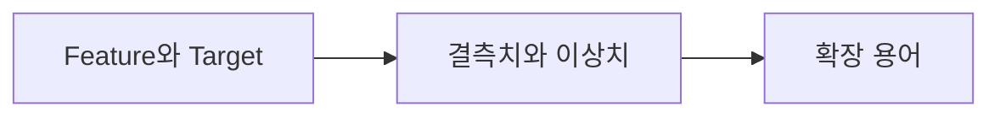

# 머신러닝 EDA 용어 정리

[원문 보기](https://velog.io/@doldolkoong/%EB%A8%B8%EC%8B%A0%EB%9F%AC%EB%8B%9D-EDA-%EC%9A%A9%EC%96%B4-%EC%A0%95%EB%A6%AC) · 2026-09-08 정리

> [!tip] 💡 이 수업을 한 문장으로
> EDA의 용어를 데이터 점검 → 전처리 → 모델 평가의 흐름으로 연결한다.

> [!example] 🎨 한 줄 비유
> 건강검진에서 수치와 영상을 함께 보고 다음 검사를 결정하는 과정이다.

## 📌 선행지식

| 필요한 지식 | 어느 정도로? | 관련 노트 |
|---|---|---|
| Seaborn Titanic 데이터로 EDA 연습하기 | 핵심 용어와 입력·출력 흐름 설명 | [[Seaborn Titanic 데이터로 EDA 연습하기\|Seaborn Titanic 데이터로 EDA 연습하기]] |
| DAY19 - EDA와 결측치 처리 | 핵심 용어와 입력·출력 흐름 설명 | [[DAY19 - EDA와 결측치 처리\|DAY19 - EDA와 결측치 처리]] |

## 🎯 학습 목표

- [ ] EDA의 용어를 데이터 점검 → 전처리 → 모델 평가의 흐름으로 연결한다.
- [ ] Feature와 Target: 예제로 설명할 수 있다.
- [ ] 결측치와 이상치: 예제로 설명할 수 있다.
- [ ] 분포와 관계: 예제로 설명할 수 있다.

## 1단원 — 핵심 정의 🟢 ⭐

### ① 무엇인가?

EDA의 용어를 데이터 점검 → 전처리 → 모델 평가의 흐름으로 연결한다.

### ② 왜 필요한가?

관측 단위·컬럼 의미·shape·dtype를 먼저 적는다. 누수를 막는 전처리와 검증 방법을 정하고 평가 지표를 선택한다. 이를 통해 Feature와 Target에서 확장 용어까지 연결해 이해한다.

### ③ 쉽게 이해하기 🎨

> [!example] 비유
> 건강검진에서 수치와 영상을 함께 보고 다음 검사를 결정하는 과정이다.

### ④ 핵심 용어

| 용어 | 뜻과 적용 포인트 |
|---|---|
| Feature와 Target | 입력 X와 예측할 정답 y를 구분한다. 숫자로 저장된 pclass도 의미상 범주형이다. |
| 결측치와 이상치 | isna로 누락을 확인하고 IQR로 극단값 후보를 찾되, 값의 의미를 보고 처리한다. |
| 분포와 관계 | 평균·중앙값·산포도·왜도·상관계수와 그래프를 함께 읽는다. |
| 전처리와 누수 | 인코딩·스케일링·결측 대체 기준은 학습 데이터에서만 학습한다. |
| 평가와 일반화 | 분류는 정밀도·재현율·F1·AUC, 회귀는 MAE·MSE·RMSE·R² 등 목적에 맞는 지표를 쓴다. |
| 확장 용어 | 차원 축소, 교차검증, 시계열, 분포 변화, 모델 해석까지 원문 용어집에서 찾아 연결한다. |

## 2단원 — 원리 / 동작 과정 🔵 ⭐

### ① 전체 흐름

1. 관측 단위·컬럼 의미·shape·dtype를 먼저 적는다.
2. 빈도·결측률·중복·분포·그룹별 관계를 확인한다.
3. 누수를 막는 전처리와 검증 방법을 정하고 평가 지표를 선택한다.

### ② 왜 이렇게 동작하는가?

isna로 누락을 확인하고 IQR로 극단값 후보를 찾되, 값의 의미를 보고 처리한다. 차원 축소, 교차검증, 시계열, 분포 변화, 모델 해석까지 원문 용어집에서 찾아 연결한다.

### ③ 그림으로 설명



## 3단원 — 코드 / 공식 🔵 ⭐

### ① 핵심 코드

> 아래는 원문의 개념을 작은 입력으로 재구성한 학습용 예제다. 원문 코드는 하단 원문에서 확인할 수 있다.

```python
import pandas as pd
s = pd.Series([1, 2, 3, 4, 100, None])
print(s.isna().sum())
print(s.mean(), s.median())
```

### ② 코드 이해

| 읽는 순서 | 의미 |
|---|---|
| 입력과 전제 | 관측 단위·컬럼 의미·shape·dtype를 먼저 적는다. |
| 처리 | 빈도·결측률·중복·분포·그룹별 관계를 확인한다. |
| 결과 | 평균은 100의 영향을 크게 받지만 중앙값은 3이다. 결측값 하나는 기본 집계에서 제외된다. |

### ③ 실행 결과

**예상 결과·해석 기준 — 실제 환경 실행 결과와 구분**

```text
1
22.0 3.0
```

### ④ 결과 해석

평균은 100의 영향을 크게 받지만 중앙값은 3이다. 결측값 하나는 기본 집계에서 제외된다.

## 4단원 — 실습 🚀

### 🧪 실습

**문제**

[1, 2, 3, 4, 100]에서 평균과 중앙값 중 극단값 영향을 적게 받는 값은?

**내 코드 / 내 풀이**

> 직접 풀이한 뒤 이 칸에 기록한다. 아래 해설을 보기 전에 먼저 답을 생각한다.

**결과·해석**

<details>
<summary>해설 보기</summary>

중앙값 3이다. 평균은 22로 커진다. 단, 어떤 통계량이 목적에 적합한지는 분석 질문에 따라 정한다.

</details>

## 🔧 디버깅 포인트

| 증상 | 원인 | 해결 |
|---|---|---|
| 상관계수가 0이면 관계가 없다고 판단 | 선형관계와 비선형관계를 혼동 | 산점도와 다른 관계 지표를 함께 확인 |
| 표준화하면 정규분포가 된다고 생각 | 크기 변환과 분포 모양을 혼동 | 평균·표준편차 조정은 분포 모양의 정규성을 보장하지 않는다 |

## 🤖 ChatGPT 요약 붙여넣기

### 📚 이번 수업에서 배운 내용

- **Feature와 Target**: 입력 X와 예측할 정답 y를 구분한다. 숫자로 저장된 pclass도 의미상 범주형이다.
- **결측치와 이상치**: isna로 누락을 확인하고 IQR로 극단값 후보를 찾되, 값의 의미를 보고 처리한다.
- **분포와 관계**: 평균·중앙값·산포도·왜도·상관계수와 그래프를 함께 읽는다.
- **전처리와 누수**: 인코딩·스케일링·결측 대체 기준은 학습 데이터에서만 학습한다.
- **평가와 일반화**: 분류는 정밀도·재현율·F1·AUC, 회귀는 MAE·MSE·RMSE·R² 등 목적에 맞는 지표를 쓴다.
- **확장 용어**: 차원 축소, 교차검증, 시계열, 분포 변화, 모델 해석까지 원문 용어집에서 찾아 연결한다.

### 🔑 핵심 문장 3개

1. EDA의 용어를 데이터 점검 → 전처리 → 모델 평가의 흐름으로 연결한다.
2. isna로 누락을 확인하고 IQR로 극단값 후보를 찾되, 값의 의미를 보고 처리한다.
3. 차원 축소, 교차검증, 시계열, 분포 변화, 모델 해석까지 원문 용어집에서 찾아 연결한다.

### ⚠️ 시험 / 면접 포인트

- Feature와 Target의 핵심은 무엇인가?
- 결측치와 이상치를 잘못 이해하면 어떤 문제가 생기는가?
- [1, 2, 3, 4, 100]에서 평균과 중앙값 중 극단값 영향을 적게 받는 값은?

### ✅ 개념 체크리스트

- [ ] Feature와 Target의 의미와 원문에서 사용한 이유를 설명할 수 있는가?
- [ ] 결측치와 이상치의 의미와 원문에서 사용한 이유를 설명할 수 있는가?
- [ ] 분포와 관계의 의미와 원문에서 사용한 이유를 설명할 수 있는가?
- [ ] 전처리와 누수의 의미와 원문에서 사용한 이유를 설명할 수 있는가?
- [ ] 평가와 일반화의 의미와 원문에서 사용한 이유를 설명할 수 있는가?
- [ ] 확장 용어의 의미와 원문에서 사용한 이유를 설명할 수 있는가?

### ⚠️ 실수 방지 체크리스트

| 흔한 실수 | 바로잡기 |
|---|---|
| 상관계수가 0이면 관계가 없다고 판단 | 산점도와 다른 관계 지표를 함께 확인 |
| 표준화하면 정규분포가 된다고 생각 | 평균·표준편차 조정은 분포 모양의 정규성을 보장하지 않는다 |

### 📝 미니 연습문제

1. Feature와 Target의 핵심은 무엇인가?

<details>
<summary>해설 보기</summary>

입력 X와 예측할 정답 y를 구분한다. 숫자로 저장된 pclass도 의미상 범주형이다.

</details>

2. 결측치와 이상치를 잘못 이해하면 어떤 문제가 생기는가?

<details>
<summary>해설 보기</summary>

isna로 누락을 확인하고 IQR로 극단값 후보를 찾되, 값의 의미를 보고 처리한다.

</details>

3. 코드 또는 처리 예시의 결과를 설명하라.

<details>
<summary>해설 보기</summary>

평균은 100의 영향을 크게 받지만 중앙값은 3이다. 결측값 하나는 기본 집계에서 제외된다.

</details>

4. [1, 2, 3, 4, 100]에서 평균과 중앙값 중 극단값 영향을 적게 받는 값은?

<details>
<summary>해설 보기</summary>

중앙값 3이다. 평균은 22로 커진다. 단, 어떤 통계량이 목적에 적합한지는 분석 질문에 따라 정한다.

</details>

# 🔁 복습 스케줄

- [ ] **1일 복습** [stage:: 1D] [due:: 2026-09-09]
- [ ] **7일 복습** [stage:: 7D] [due:: 2026-09-15]
- [ ] **30일 복습** [stage:: 30D] [due:: 2026-10-08]

### 복습 방법

1. 요약을 가리고 핵심 개념 3개를 설명한다.
2. 예제 또는 처리 흐름을 보지 않고 재현한다.
3. 해설과 비교하고 틀린 부분을 기록한다.
4. 실제 복습을 마친 뒤 체크한다.

## 🔗 관련 노트

- [[Seaborn Titanic 데이터로 EDA 연습하기|Seaborn Titanic 데이터로 EDA 연습하기]]
- [[DAY19 - EDA와 결측치 처리|DAY19 - EDA와 결측치 처리]]
- [[DAY20 - 머신러닝 워크플로우와 데이터 누수|DAY20 - 머신러닝 워크플로우와 데이터 누수]]
- [[00_Dashboard/Velog 학습 자료 목차|전체 32개 글 목차]]

## 📎 원문과 확인 자료

- [Velog 원문](https://velog.io/@doldolkoong/%EB%A8%B8%EC%8B%A0%EB%9F%AC%EB%8B%9D-EDA-%EC%9A%A9%EC%96%B4-%EC%A0%95%EB%A6%AC)


> [!quote]- 원문 전체 보기 — 코드·표·이미지 링크 포함
> ![[90_Sources/Velog/01 - 머신러닝 EDA 용어 정리 - 원문]]
