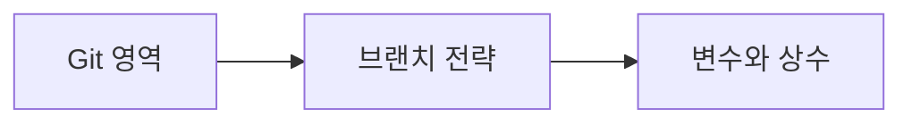

# DAY2 - Git과 Python 가상환경 및 변수

[원문 보기](https://velog.io/@doldolkoong/%ED%94%8C%EB%A0%88%EC%9D%B4%EB%8D%B0%EC%9D%B4%ED%84%B0-SK%EB%84%A4%ED%8A%B8%EC%9B%8D%EC%8A%A4-Family-AI-%EC%BA%A0%ED%94%84-36%EA%B8%B0-DAY-2-26.08.07) · 2026-09-08 정리

> [!attention] 원문 확인·보완
> origin은 원격 저장소의 관례적 이름이며 GitHub 자체를 뜻하는 예약어가 아니다. Git Flow식 브랜치 규칙도 팀별 선택이다.

> [!tip] 💡 이 수업을 한 문장으로
> Git의 변경 저장 흐름과 프로젝트별 Python 환경을 구분하고 변수·상수 표현을 익힌다.

> [!example] 🎨 한 줄 비유
> Git은 작업의 이력을 남기고 가상환경은 프로젝트마다 별도 공구함을 둔다.

## 📌 선행지식

| 필요한 지식 | 어느 정도로? | 관련 노트 |
|---|---|---|
| DAY1 - 개발 환경 구축 | 핵심 용어와 입력·출력 흐름 설명 | [[DAY1 - 개발 환경 구축\|DAY1 - 개발 환경 구축]] |
| DAY12 - GitHub 팀 협업과 PR | 핵심 용어와 입력·출력 흐름 설명 | [[DAY12 - GitHub 팀 협업과 PR\|DAY12 - GitHub 팀 협업과 PR]] |

## 🎯 학습 목표

- [ ] Git의 변경 저장 흐름과 프로젝트별 Python 환경을 구분하고 변수·상수 표현을 익힌다.
- [ ] Git 영역: 예제로 설명할 수 있다.
- [ ] 브랜치 전략: 예제로 설명할 수 있다.
- [ ] 가상환경: 예제로 설명할 수 있다.

## 1단원 — 핵심 정의 🟢 ⭐

### ① 무엇인가?

Git의 변경 저장 흐름과 프로젝트별 Python 환경을 구분하고 변수·상수 표현을 익힌다.

### ② 왜 필요한가?

수정 파일과 staging·commit·원격 상태를 구분한다. 변수·타입·Enum 예제로 코드가 사용하는 값의 의미를 확인한다. 이를 통해 Git 영역에서 변수와 상수까지 연결해 이해한다.

### ③ 쉽게 이해하기 🎨

> [!example] 비유
> Git은 작업의 이력을 남기고 가상환경은 프로젝트마다 별도 공구함을 둔다.

### ④ 핵심 용어

| 용어 | 뜻과 적용 포인트 |
|---|---|
| Git 영역 | 작업 폴더 → staging → 로컬 commit → 원격 저장소의 흐름을 구별한다. |
| 브랜치 전략 | main·develop·feature·release·hotfix는 원문에서 배운 전략이며 모든 팀의 필수 구조는 아니다. |
| 가상환경 | venv는 프로젝트의 패키지를 분리한다. 실제 사용 인터프리터 경로도 확인한다. |
| pip와 uv | 패키지 설치와 프로젝트 의존성 관리, 환경 디렉터리 제거는 서로 다른 작업이다. |
| 변수와 상수 | 이름에 값을 바인딩하며 대문자 상수 이름은 관례다. Enum으로 제한된 후보를 표현할 수 있다. |

## 2단원 — 원리 / 동작 과정 🔵 ⭐

### ① 전체 흐름

1. 수정 파일과 staging·commit·원격 상태를 구분한다.
2. 프로젝트 환경을 만들고 선택된 Python 경로를 확인한다.
3. 변수·타입·Enum 예제로 코드가 사용하는 값의 의미를 확인한다.

### ② 왜 이렇게 동작하는가?

main·develop·feature·release·hotfix는 원문에서 배운 전략이며 모든 팀의 필수 구조는 아니다. 이름에 값을 바인딩하며 대문자 상수 이름은 관례다. Enum으로 제한된 후보를 표현할 수 있다.

### ③ 그림으로 설명



## 3단원 — 코드 / 공식 🔵 ⭐

### ① 핵심 코드

> 아래는 원문의 개념을 작은 입력으로 재구성한 학습용 예제다. 원문 코드는 하단 원문에서 확인할 수 있다.

```python
import sys
from enum import Enum
class Mode(Enum):
    STUDY = 1
    PROJECT = 2
print(Mode.STUDY.name)
print(sys.prefix == sys.base_prefix)
```

### ② 코드 이해

| 읽는 순서 | 의미 |
|---|---|
| 입력과 전제 | 수정 파일과 staging·commit·원격 상태를 구분한다. |
| 처리 | 프로젝트 환경을 만들고 선택된 Python 경로를 확인한다. |
| 결과 | 환경 여부는 실행 위치에 따라 달라진다. 고정 버전이나 설치 성공을 가정하지 않는다. |

### ③ 실행 결과

**예상 결과·해석 기준 — 실제 환경 실행 결과와 구분**

```text
STUDY
가상환경에서 실행하면 보통 False, 기본 인터프리터에서는 True.
```

### ④ 결과 해석

환경 여부는 실행 위치에 따라 달라진다. 고정 버전이나 설치 성공을 가정하지 않는다.

## 4단원 — 실습 🚀

### 🧪 실습

**문제**

git add와 git commit, git push는 같은 작업인가?

**내 코드 / 내 풀이**

> 직접 풀이한 뒤 이 칸에 기록한다. 아래 해설을 보기 전에 먼저 답을 생각한다.

**결과·해석**

<details>
<summary>해설 보기</summary>

add는 다음 커밋에 포함할 변경을 staging하고 commit은 로컬 이력을 만들며 push는 원격에 커밋을 전송한다.

</details>

## 🔧 디버깅 포인트

| 증상 | 원인 | 해결 |
|---|---|---|
| uv remove로 환경 폴더를 지우려 함 | 프로젝트 의존성 제거와 폴더 삭제 혼동 | 명령의 대상을 구분 |
| pip 설치 후 import 실패 | 다른 인터프리터에 설치 | 실행 Python 경로와 패키지 환경을 대조 |

## 🤖 ChatGPT 요약 붙여넣기

### 📚 이번 수업에서 배운 내용

- **Git 영역**: 작업 폴더 → staging → 로컬 commit → 원격 저장소의 흐름을 구별한다.
- **브랜치 전략**: main·develop·feature·release·hotfix는 원문에서 배운 전략이며 모든 팀의 필수 구조는 아니다.
- **가상환경**: venv는 프로젝트의 패키지를 분리한다. 실제 사용 인터프리터 경로도 확인한다.
- **pip와 uv**: 패키지 설치와 프로젝트 의존성 관리, 환경 디렉터리 제거는 서로 다른 작업이다.
- **변수와 상수**: 이름에 값을 바인딩하며 대문자 상수 이름은 관례다. Enum으로 제한된 후보를 표현할 수 있다.

### 🔑 핵심 문장 3개

1. Git의 변경 저장 흐름과 프로젝트별 Python 환경을 구분하고 변수·상수 표현을 익힌다.
2. main·develop·feature·release·hotfix는 원문에서 배운 전략이며 모든 팀의 필수 구조는 아니다.
3. 이름에 값을 바인딩하며 대문자 상수 이름은 관례다. Enum으로 제한된 후보를 표현할 수 있다.

### ⚠️ 시험 / 면접 포인트

- Git 영역의 핵심은 무엇인가?
- 브랜치 전략를 잘못 이해하면 어떤 문제가 생기는가?
- git add와 git commit, git push는 같은 작업인가?

### ✅ 개념 체크리스트

- [ ] Git 영역의 의미와 원문에서 사용한 이유를 설명할 수 있는가?
- [ ] 브랜치 전략의 의미와 원문에서 사용한 이유를 설명할 수 있는가?
- [ ] 가상환경의 의미와 원문에서 사용한 이유를 설명할 수 있는가?
- [ ] pip와 uv의 의미와 원문에서 사용한 이유를 설명할 수 있는가?
- [ ] 변수와 상수의 의미와 원문에서 사용한 이유를 설명할 수 있는가?

### ⚠️ 실수 방지 체크리스트

| 흔한 실수 | 바로잡기 |
|---|---|
| uv remove로 환경 폴더를 지우려 함 | 명령의 대상을 구분 |
| pip 설치 후 import 실패 | 실행 Python 경로와 패키지 환경을 대조 |

### 📝 미니 연습문제

1. Git 영역의 핵심은 무엇인가?

<details>
<summary>해설 보기</summary>

작업 폴더 → staging → 로컬 commit → 원격 저장소의 흐름을 구별한다.

</details>

2. 브랜치 전략를 잘못 이해하면 어떤 문제가 생기는가?

<details>
<summary>해설 보기</summary>

main·develop·feature·release·hotfix는 원문에서 배운 전략이며 모든 팀의 필수 구조는 아니다.

</details>

3. 코드 또는 처리 예시의 결과를 설명하라.

<details>
<summary>해설 보기</summary>

환경 여부는 실행 위치에 따라 달라진다. 고정 버전이나 설치 성공을 가정하지 않는다.

</details>

4. git add와 git commit, git push는 같은 작업인가?

<details>
<summary>해설 보기</summary>

add는 다음 커밋에 포함할 변경을 staging하고 commit은 로컬 이력을 만들며 push는 원격에 커밋을 전송한다.

</details>

# 🔁 복습 스케줄

- [ ] **1일 복습** [stage:: 1D] [due:: 2026-09-09]
- [ ] **7일 복습** [stage:: 7D] [due:: 2026-09-15]
- [ ] **30일 복습** [stage:: 30D] [due:: 2026-10-08]

### 복습 방법

1. 요약을 가리고 핵심 개념 3개를 설명한다.
2. 예제 또는 처리 흐름을 보지 않고 재현한다.
3. 해설과 비교하고 틀린 부분을 기록한다.
4. 실제 복습을 마친 뒤 체크한다.

## 🔗 관련 노트

- [[DAY1 - 개발 환경 구축|DAY1 - 개발 환경 구축]]
- [[DAY12 - GitHub 팀 협업과 PR|DAY12 - GitHub 팀 협업과 PR]]
- [[DAY3 - 자료형과 제어문 및 예외 처리|DAY3 - 자료형과 제어문 및 예외 처리]]
- [[00_Dashboard/Velog 학습 자료 목차|전체 32개 글 목차]]

## 📎 원문과 확인 자료

- [Velog 원문](https://velog.io/@doldolkoong/%ED%94%8C%EB%A0%88%EC%9D%B4%EB%8D%B0%EC%9D%B4%ED%84%B0-SK%EB%84%A4%ED%8A%B8%EC%9B%8D%EC%8A%A4-Family-AI-%EC%BA%A0%ED%94%84-36%EA%B8%B0-DAY-2-26.08.07)


> [!quote]- 원문 전체 보기 — 코드·표·이미지 링크 포함
> ![[90_Sources/Velog/31 - DAY2 - Git과 Python 가상환경 및 변수 - 원문]]
