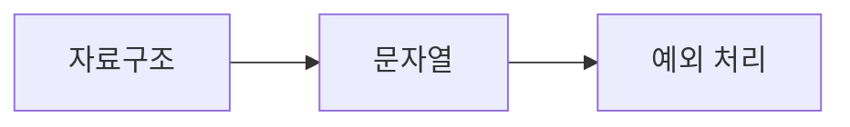

# DAY3 - 자료형과 제어문 및 예외 처리

[원문 보기](https://velog.io/@doldolkoong/%ED%94%8C%EB%A0%88%EC%9D%B4%EB%8D%B0%EC%9D%B4%ED%84%B0-SK%EB%84%A4%ED%8A%B8%EC%9B%8D%EC%8A%A4-Family-AI-%EC%BA%A0%ED%94%84-36%EA%B8%B0-DAY3-26.08.10) · 2026-09-08 정리

> [!attention] 원문 확인·보완
> TypeError는 부적절한 타입의 연산·인자에 관한 오류다. 없는 이름은 NameError, 없는 키는 KeyError, 범위 밖 인덱스는 IndexError로 구분한다.

> [!tip] 💡 이 수업을 한 문장으로
> 자료형에 맞는 연산을 선택하고 조건·반복·예외로 프로그램 흐름을 제어한다.

> [!example] 🎨 한 줄 비유
> 자료형은 담는 그릇이고 제어문은 처리 순서, 예외 처리는 예상 밖 상황의 분기다.

## 📌 선행지식

| 필요한 지식 | 어느 정도로? | 관련 노트 |
|---|---|---|
| 숫자 맞추기 게임 | 핵심 용어와 입력·출력 흐름 설명 | [[숫자 맞추기 게임\|숫자 맞추기 게임]] |
| DAY4 - 함수와 특수 함수 | 핵심 용어와 입력·출력 흐름 설명 | [[DAY4 - 함수와 특수 함수\|DAY4 - 함수와 특수 함수]] |

## 🎯 학습 목표

- [ ] 자료형에 맞는 연산을 선택하고 조건·반복·예외로 프로그램 흐름을 제어한다.
- [ ] 자료구조: 예제로 설명할 수 있다.
- [ ] 문자열: 예제로 설명할 수 있다.
- [ ] 조건과 반복: 예제로 설명할 수 있다.

## 1단원 — 핵심 정의 🟢 ⭐

### ① 무엇인가?

자료형에 맞는 연산을 선택하고 조건·반복·예외로 프로그램 흐름을 제어한다.

### ② 왜 필요한가?

입력의 타입과 허용값을 정한다. 변환 실패·경계값·종료 조건을 분리해 확인한다. 이를 통해 자료구조에서 예외 처리까지 연결해 이해한다.

### ③ 쉽게 이해하기 🎨

> [!example] 비유
> 자료형은 담는 그릇이고 제어문은 처리 순서, 예외 처리는 예상 밖 상황의 분기다.

### ④ 핵심 용어

| 용어 | 뜻과 적용 포인트 |
|---|---|
| 자료구조 | list·tuple·dict·set의 순서·변경 가능성·키·중복 조건을 구분한다. |
| 문자열 | 인덱싱·슬라이싱·split·strip·replace로 데이터를 정리한다. |
| 조건과 반복 | if·for·while로 분기·반복하고 break·continue·pass 역할을 구별한다. |
| 반복문의 else | break 없이 반복이 끝났을 때 실행된다. |
| 예외 처리 | TypeError·ValueError·KeyError 등의 의미를 구별하고 필요한 예외만 처리한다. |

## 2단원 — 원리 / 동작 과정 🔵 ⭐

### ① 전체 흐름

1. 입력의 타입과 허용값을 정한다.
2. 정상 흐름을 조건문·반복문으로 구현한다.
3. 변환 실패·경계값·종료 조건을 분리해 확인한다.

### ② 왜 이렇게 동작하는가?

인덱싱·슬라이싱·split·strip·replace로 데이터를 정리한다. TypeError·ValueError·KeyError 등의 의미를 구별하고 필요한 예외만 처리한다.

### ③ 그림으로 설명



## 3단원 — 코드 / 공식 🔵 ⭐

### ① 핵심 코드

> 아래는 원문의 개념을 작은 입력으로 재구성한 학습용 예제다. 원문 코드는 하단 원문에서 확인할 수 있다.

```python
for text in ['3', 'x', '5']:
    try:
        value = int(text)
    except ValueError:
        print('invalid')
        continue
    print(value*2)
else:
    print('finished')
```

### ② 코드 이해

| 읽는 순서 | 의미 |
|---|---|
| 입력과 전제 | 입력의 타입과 허용값을 정한다. |
| 처리 | 정상 흐름을 조건문·반복문으로 구현한다. |
| 결과 | 변환 실패 후 continue해도 break는 없으므로 for-else가 실행된다. |

### ③ 실행 결과

**예상 결과·해석 기준 — 실제 환경 실행 결과와 구분**

```text
6
invalid
10
finished
```

### ④ 결과 해석

변환 실패 후 continue해도 break는 없으므로 for-else가 실행된다.

## 4단원 — 실습 🚀

### 🧪 실습

**문제**

continue가 한 번 실행되면 for-else는 실행되지 않는가?

**내 코드 / 내 풀이**

> 직접 풀이한 뒤 이 칸에 기록한다. 아래 해설을 보기 전에 먼저 답을 생각한다.

**결과·해석**

<details>
<summary>해설 보기</summary>

아니다. else를 막는 것은 해당 반복문의 break이다. continue는 다음 반복으로 이동할 뿐이다.

</details>

## 🔧 디버깅 포인트

| 증상 | 원인 | 해결 |
|---|---|---|
| 없는 키를 TypeError로 생각 | 예외 종류 혼동 | 없는 딕셔너리 키는 KeyError, 타입 부적합은 TypeError 등으로 구별 |
| 모든 오류를 except로 숨김 | 실패 원인이 보이지 않음 | 처리하려는 구체적 예외를 지정 |

## 🤖 ChatGPT 요약 붙여넣기

### 📚 이번 수업에서 배운 내용

- **자료구조**: list·tuple·dict·set의 순서·변경 가능성·키·중복 조건을 구분한다.
- **문자열**: 인덱싱·슬라이싱·split·strip·replace로 데이터를 정리한다.
- **조건과 반복**: if·for·while로 분기·반복하고 break·continue·pass 역할을 구별한다.
- **반복문의 else**: break 없이 반복이 끝났을 때 실행된다.
- **예외 처리**: TypeError·ValueError·KeyError 등의 의미를 구별하고 필요한 예외만 처리한다.

### 🔑 핵심 문장 3개

1. 자료형에 맞는 연산을 선택하고 조건·반복·예외로 프로그램 흐름을 제어한다.
2. 인덱싱·슬라이싱·split·strip·replace로 데이터를 정리한다.
3. TypeError·ValueError·KeyError 등의 의미를 구별하고 필요한 예외만 처리한다.

### ⚠️ 시험 / 면접 포인트

- 자료구조의 핵심은 무엇인가?
- 문자열를 잘못 이해하면 어떤 문제가 생기는가?
- continue가 한 번 실행되면 for-else는 실행되지 않는가?

### ✅ 개념 체크리스트

- [ ] 자료구조의 의미와 원문에서 사용한 이유를 설명할 수 있는가?
- [ ] 문자열의 의미와 원문에서 사용한 이유를 설명할 수 있는가?
- [ ] 조건과 반복의 의미와 원문에서 사용한 이유를 설명할 수 있는가?
- [ ] 반복문의 else의 의미와 원문에서 사용한 이유를 설명할 수 있는가?
- [ ] 예외 처리의 의미와 원문에서 사용한 이유를 설명할 수 있는가?

### ⚠️ 실수 방지 체크리스트

| 흔한 실수 | 바로잡기 |
|---|---|
| 없는 키를 TypeError로 생각 | 없는 딕셔너리 키는 KeyError, 타입 부적합은 TypeError 등으로 구별 |
| 모든 오류를 except로 숨김 | 처리하려는 구체적 예외를 지정 |

### 📝 미니 연습문제

1. 자료구조의 핵심은 무엇인가?

<details>
<summary>해설 보기</summary>

list·tuple·dict·set의 순서·변경 가능성·키·중복 조건을 구분한다.

</details>

2. 문자열를 잘못 이해하면 어떤 문제가 생기는가?

<details>
<summary>해설 보기</summary>

인덱싱·슬라이싱·split·strip·replace로 데이터를 정리한다.

</details>

3. 코드 또는 처리 예시의 결과를 설명하라.

<details>
<summary>해설 보기</summary>

변환 실패 후 continue해도 break는 없으므로 for-else가 실행된다.

</details>

4. continue가 한 번 실행되면 for-else는 실행되지 않는가?

<details>
<summary>해설 보기</summary>

아니다. else를 막는 것은 해당 반복문의 break이다. continue는 다음 반복으로 이동할 뿐이다.

</details>

# 🔁 복습 스케줄

- [ ] **1일 복습** [stage:: 1D] [due:: 2026-09-09]
- [ ] **7일 복습** [stage:: 7D] [due:: 2026-09-15]
- [ ] **30일 복습** [stage:: 30D] [due:: 2026-10-08]

### 복습 방법

1. 요약을 가리고 핵심 개념 3개를 설명한다.
2. 예제 또는 처리 흐름을 보지 않고 재현한다.
3. 해설과 비교하고 틀린 부분을 기록한다.
4. 실제 복습을 마친 뒤 체크한다.

## 🔗 관련 노트

- [[숫자 맞추기 게임|숫자 맞추기 게임]]
- [[DAY4 - 함수와 특수 함수|DAY4 - 함수와 특수 함수]]
- [[00_Dashboard/Velog 학습 자료 목차|전체 32개 글 목차]]

## 📎 원문과 확인 자료

- [Velog 원문](https://velog.io/@doldolkoong/%ED%94%8C%EB%A0%88%EC%9D%B4%EB%8D%B0%EC%9D%B4%ED%84%B0-SK%EB%84%A4%ED%8A%B8%EC%9B%8D%EC%8A%A4-Family-AI-%EC%BA%A0%ED%94%84-36%EA%B8%B0-DAY3-26.08.10)
- [공식 문서 확인](https://docs.python.org/3/library/exceptions.html)

> [!quote]- 원문 전체 보기 — 코드·표·이미지 링크 포함
> ![[90_Sources/Velog/29 - DAY3 - 자료형과 제어문 및 예외 처리 - 원문]]
