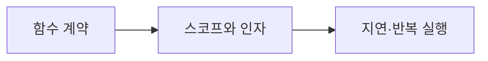

# DAY4 - 함수와 특수 함수

[원문 보기](https://velog.io/@doldolkoong/%ED%94%8C%EB%A0%88%EC%9D%B4%EB%8D%B0%EC%9D%B4%ED%84%B0-SK%EB%84%A4%ED%8A%B8%EC%9B%8D%EC%8A%A4-Family-AI-%EC%BA%A0%ED%94%84-36%EA%B8%B0-DAY4-26.08.11) · 2026-09-08 정리

> [!tip] 💡 이 수업을 한 문장으로
> 입력·반환값·스코프를 명확히 하고 함수의 재사용과 실행 시점을 이해한다.

> [!example] 🎨 한 줄 비유
> 재료를 받아 결과를 돌려주는 작은 작업 단위를 조합한다.

## 📌 선행지식

| 필요한 지식 | 어느 정도로? | 관련 노트 |
|---|---|---|
| DAY3 - 자료형과 제어문 및 예외 처리 | 핵심 용어와 입력·출력 흐름 설명 | [[DAY3 - 자료형과 제어문 및 예외 처리\|DAY3 - 자료형과 제어문 및 예외 처리]] |
| DAY5 - Enum과 클래스 및 모듈 | 핵심 용어와 입력·출력 흐름 설명 | [[DAY5 - Enum과 클래스 및 모듈\|DAY5 - Enum과 클래스 및 모듈]] |

## 🎯 학습 목표

- [ ] 입력·반환값·스코프를 명확히 하고 함수의 재사용과 실행 시점을 이해한다.
- [ ] 함수 계약: 예제로 설명할 수 있다.
- [ ] 스코프와 인자: 예제로 설명할 수 있다.
- [ ] 정렬과 통계: 예제로 설명할 수 있다.

## 1단원 — 핵심 정의 🟢 ⭐

### ① 무엇인가?

입력·반환값·스코프를 명확히 하고 함수의 재사용과 실행 시점을 이해한다.

### ② 왜 필요한가?

함수의 입력 타입·출력·예외 조건을 적는다. 함수 전달·반복·지연 실행이 필요한 지점을 작은 예제로 확인한다. 이를 통해 함수 계약에서 지연·반복 실행까지 연결해 이해한다.

### ③ 쉽게 이해하기 🎨

> [!example] 비유
> 재료를 받아 결과를 돌려주는 작은 작업 단위를 조합한다.

### ④ 핵심 용어

| 용어 | 뜻과 적용 포인트 |
|---|---|
| 함수 계약 | 입력 유무와 반환값 유무를 구분한다. print는 화면 출력이며 return과 다르다. |
| 스코프와 인자 | 지역·전역 범위, 기본값, *args, **kwargs의 전달 방식을 구분한다. |
| 정렬과 통계 | 정렬 결과로 최솟값·최댓값·중앙값을 구할 때 빈 목록과 짝수 길이를 고려한다. |
| 함수를 값으로 사용 | 람다·콜백·클로저·데코레이터는 함수를 전달하거나 감싸는 방식이다. |
| 지연·반복 실행 | 재귀는 종료 조건이 필요하며 이터레이터·제너레이터는 값을 순서대로 제공한다. |

## 2단원 — 원리 / 동작 과정 🔵 ⭐

### ① 전체 흐름

1. 함수의 입력 타입·출력·예외 조건을 적는다.
2. 핵심 계산을 함수로 만들고 UI 입출력과 구별한다.
3. 함수 전달·반복·지연 실행이 필요한 지점을 작은 예제로 확인한다.

### ② 왜 이렇게 동작하는가?

지역·전역 범위, 기본값, *args, **kwargs의 전달 방식을 구분한다. 재귀는 종료 조건이 필요하며 이터레이터·제너레이터는 값을 순서대로 제공한다.

### ③ 그림으로 설명



## 3단원 — 코드 / 공식 🔵 ⭐

### ① 핵심 코드

> 아래는 원문의 개념을 작은 입력으로 재구성한 학습용 예제다. 원문 코드는 하단 원문에서 확인할 수 있다.

```python
def stats(values):
    ordered = sorted(values)
    if not ordered:
        raise ValueError('empty data')
    n = len(ordered)
    mid = (ordered[(n-1)//2]+ordered[n//2])/2
    return ordered[0], ordered[-1], mid
print(stats([4,1,3,2]))
```

### ② 코드 이해

| 읽는 순서 | 의미 |
|---|---|
| 입력과 전제 | 함수의 입력 타입·출력·예외 조건을 적는다. |
| 처리 | 핵심 계산을 함수로 만들고 UI 입출력과 구별한다. |
| 결과 | 정렬한 네 값의 가운데 두 값 2·3을 평균해 중앙값 2.5를 구한다. |

### ③ 실행 결과

**예상 결과·해석 기준 — 실제 환경 실행 결과와 구분**

```text
(1, 4, 2.5)
```

### ④ 결과 해석

정렬한 네 값의 가운데 두 값 2·3을 평균해 중앙값 2.5를 구한다.

## 4단원 — 실습 🚀

### 🧪 실습

**문제**

함수 안에서 print(3)만 실행한 함수의 반환값은?

**내 코드 / 내 풀이**

> 직접 풀이한 뒤 이 칸에 기록한다. 아래 해설을 보기 전에 먼저 답을 생각한다.

**결과·해석**

<details>
<summary>해설 보기</summary>

명시적 return이 없으면 None이다. 화면에 출력되는 3과 반환값은 다르다.

</details>

## 🔧 디버깅 포인트

| 증상 | 원인 | 해결 |
|---|---|---|
| print한 값으로 후속 계산 불가 | 출력과 반환 혼동 | 계산 결과를 return |
| 짝수 길이에서 가운데 값 하나만 선택 | 중앙값 정의 누락 | 가운데 두 값의 평균 계산 |

## 🤖 ChatGPT 요약 붙여넣기

### 📚 이번 수업에서 배운 내용

- **함수 계약**: 입력 유무와 반환값 유무를 구분한다. print는 화면 출력이며 return과 다르다.
- **스코프와 인자**: 지역·전역 범위, 기본값, *args, **kwargs의 전달 방식을 구분한다.
- **정렬과 통계**: 정렬 결과로 최솟값·최댓값·중앙값을 구할 때 빈 목록과 짝수 길이를 고려한다.
- **함수를 값으로 사용**: 람다·콜백·클로저·데코레이터는 함수를 전달하거나 감싸는 방식이다.
- **지연·반복 실행**: 재귀는 종료 조건이 필요하며 이터레이터·제너레이터는 값을 순서대로 제공한다.

### 🔑 핵심 문장 3개

1. 입력·반환값·스코프를 명확히 하고 함수의 재사용과 실행 시점을 이해한다.
2. 지역·전역 범위, 기본값, *args, **kwargs의 전달 방식을 구분한다.
3. 재귀는 종료 조건이 필요하며 이터레이터·제너레이터는 값을 순서대로 제공한다.

### ⚠️ 시험 / 면접 포인트

- 함수 계약의 핵심은 무엇인가?
- 스코프와 인자를 잘못 이해하면 어떤 문제가 생기는가?
- 함수 안에서 print(3)만 실행한 함수의 반환값은?

### ✅ 개념 체크리스트

- [ ] 함수 계약의 의미와 원문에서 사용한 이유를 설명할 수 있는가?
- [ ] 스코프와 인자의 의미와 원문에서 사용한 이유를 설명할 수 있는가?
- [ ] 정렬과 통계의 의미와 원문에서 사용한 이유를 설명할 수 있는가?
- [ ] 함수를 값으로 사용의 의미와 원문에서 사용한 이유를 설명할 수 있는가?
- [ ] 지연·반복 실행의 의미와 원문에서 사용한 이유를 설명할 수 있는가?

### ⚠️ 실수 방지 체크리스트

| 흔한 실수 | 바로잡기 |
|---|---|
| print한 값으로 후속 계산 불가 | 계산 결과를 return |
| 짝수 길이에서 가운데 값 하나만 선택 | 가운데 두 값의 평균 계산 |

### 📝 미니 연습문제

1. 함수 계약의 핵심은 무엇인가?

<details>
<summary>해설 보기</summary>

입력 유무와 반환값 유무를 구분한다. print는 화면 출력이며 return과 다르다.

</details>

2. 스코프와 인자를 잘못 이해하면 어떤 문제가 생기는가?

<details>
<summary>해설 보기</summary>

지역·전역 범위, 기본값, *args, **kwargs의 전달 방식을 구분한다.

</details>

3. 코드 또는 처리 예시의 결과를 설명하라.

<details>
<summary>해설 보기</summary>

정렬한 네 값의 가운데 두 값 2·3을 평균해 중앙값 2.5를 구한다.

</details>

4. 함수 안에서 print(3)만 실행한 함수의 반환값은?

<details>
<summary>해설 보기</summary>

명시적 return이 없으면 None이다. 화면에 출력되는 3과 반환값은 다르다.

</details>

# 🔁 복습 스케줄

- [ ] **1일 복습** [stage:: 1D] [due:: 2026-09-09]
- [ ] **7일 복습** [stage:: 7D] [due:: 2026-09-15]
- [ ] **30일 복습** [stage:: 30D] [due:: 2026-10-08]

### 복습 방법

1. 요약을 가리고 핵심 개념 3개를 설명한다.
2. 예제 또는 처리 흐름을 보지 않고 재현한다.
3. 해설과 비교하고 틀린 부분을 기록한다.
4. 실제 복습을 마친 뒤 체크한다.

## 🔗 관련 노트

- [[DAY3 - 자료형과 제어문 및 예외 처리|DAY3 - 자료형과 제어문 및 예외 처리]]
- [[DAY5 - Enum과 클래스 및 모듈|DAY5 - Enum과 클래스 및 모듈]]
- [[DAY6 - 표준 라이브러리와 Streamlit|DAY6 - 표준 라이브러리와 Streamlit]]
- [[00_Dashboard/Velog 학습 자료 목차|전체 32개 글 목차]]

## 📎 원문과 확인 자료

- [Velog 원문](https://velog.io/@doldolkoong/%ED%94%8C%EB%A0%88%EC%9D%B4%EB%8D%B0%EC%9D%B4%ED%84%B0-SK%EB%84%A4%ED%8A%B8%EC%9B%8D%EC%8A%A4-Family-AI-%EC%BA%A0%ED%94%84-36%EA%B8%B0-DAY4-26.08.11)


> [!quote]- 원문 전체 보기 — 코드·표·이미지 링크 포함
> ![[90_Sources/Velog/27 - DAY4 - 함수와 특수 함수 - 원문]]
