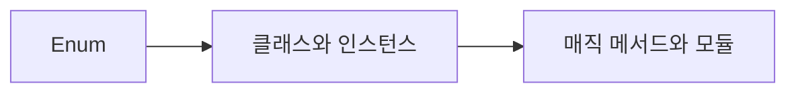

# DAY5 - Enum과 클래스 및 모듈

[원문 보기](https://velog.io/@doldolkoong/%ED%94%8C%EB%A0%88%EC%9D%B4%EB%8D%B0%EC%9D%B4%ED%84%B0-SK%EB%84%A4%ED%8A%B8%EC%9B%8D%EC%8A%A4-Family-AI-%EC%BA%A0%ED%94%84-36%EA%B8%B0-DAY5-26.08.12) · 2026-09-08 정리

> [!tip] 💡 이 수업을 한 문장으로
> 값·동작을 Enum과 클래스에 묶고 상속·프로퍼티·매직 메서드·모듈의 역할을 구분한다.

> [!example] 🎨 한 줄 비유
> 이름표만 붙인 자료에서 나아가 그 자료가 할 수 있는 동작도 함께 묶는다.

## 📌 선행지식

| 필요한 지식 | 어느 정도로? | 관련 노트 |
|---|---|---|
| DAY4 - 함수와 특수 함수 | 핵심 용어와 입력·출력 흐름 설명 | [[DAY4 - 함수와 특수 함수\|DAY4 - 함수와 특수 함수]] |
| 가위바위보·묵찌빠·하나빼기 모듈화 | 핵심 용어와 입력·출력 흐름 설명 | [[가위바위보·묵찌빠·하나빼기 모듈화\|가위바위보·묵찌빠·하나빼기 모듈화]] |

## 🎯 학습 목표

- [ ] 값·동작을 Enum과 클래스에 묶고 상속·프로퍼티·매직 메서드·모듈의 역할을 구분한다.
- [ ] Enum: 예제로 설명할 수 있다.
- [ ] 클래스와 인스턴스: 예제로 설명할 수 있다.
- [ ] 상속: 예제로 설명할 수 있다.

## 1단원 — 핵심 정의 🟢 ⭐

### ① 무엇인가?

값·동작을 Enum과 클래스에 묶고 상속·프로퍼티·매직 메서드·모듈의 역할을 구분한다.

### ② 왜 필요한가?

허용 값과 상태·행동을 구분한다. 공통 동작을 정리하고 파일별 책임 및 실행 진입점을 나눈다. 이를 통해 Enum에서 매직 메서드와 모듈까지 연결해 이해한다.

### ③ 쉽게 이해하기 🎨

> [!example] 비유
> 이름표만 붙인 자료에서 나아가 그 자료가 할 수 있는 동작도 함께 묶는다.

### ④ 핵심 용어

| 용어 | 뜻과 적용 포인트 |
|---|---|
| Enum | 가위·바위·보처럼 정해진 후보에 의미 있는 이름을 부여한다. |
| 클래스와 인스턴스 | 클래스는 객체의 상태·동작을 정의하고 인스턴스는 실제 객체이다. |
| 상속 | 공통 동작을 재사용하고 필요하면 메서드를 재정의한다. |
| property와 접근 | 속성 접근을 메서드로 제어할 수 있다. 밑줄 관례·이름 맹글링은 절대적 보안 장치가 아니다. |
| 매직 메서드와 모듈 | __init__·__str__ 같은 프로토콜과 파일별 import 구조를 구분한다. 싱글톤은 설계 선택이다. |

## 2단원 — 원리 / 동작 과정 🔵 ⭐

### ① 전체 흐름

1. 허용 값과 상태·행동을 구분한다.
2. Enum 또는 클래스로 의미와 동작을 묶는다.
3. 공통 동작을 정리하고 파일별 책임 및 실행 진입점을 나눈다.

### ② 왜 이렇게 동작하는가?

클래스는 객체의 상태·동작을 정의하고 인스턴스는 실제 객체이다. __init__·__str__ 같은 프로토콜과 파일별 import 구조를 구분한다. 싱글톤은 설계 선택이다.

### ③ 그림으로 설명



## 3단원 — 코드 / 공식 🔵 ⭐

### ① 핵심 코드

> 아래는 원문의 개념을 작은 입력으로 재구성한 학습용 예제다. 원문 코드는 하단 원문에서 확인할 수 있다.

```python
from enum import Enum
class Hand(Enum):
    SCISSORS = 1
    ROCK = 2
    PAPER = 0
    def result(self, other):
        return (self.value-other.value)%3
print(Hand.ROCK.result(Hand.SCISSORS))
print(Hand.ROCK.name)
```

### ② 코드 이해

| 읽는 순서 | 의미 |
|---|---|
| 입력과 전제 | 허용 값과 상태·행동을 구분한다. |
| 처리 | Enum 또는 클래스로 의미와 동작을 묶는다. |
| 결과 | 차이의 나머지가 1이므로 사용자 승리다. name은 이름, value는 판정에 쓰는 숫자다. |

### ③ 실행 결과

**예상 결과·해석 기준 — 실제 환경 실행 결과와 구분**

```text
1
ROCK
```

### ④ 결과 해석

차이의 나머지가 1이므로 사용자 승리다. name은 이름, value는 판정에 쓰는 숫자다.

## 4단원 — 실습 🚀

### 🧪 실습

**문제**

Enum 멤버의 name과 value는 무엇이 다른가?

**내 코드 / 내 풀이**

> 직접 풀이한 뒤 이 칸에 기록한다. 아래 해설을 보기 전에 먼저 답을 생각한다.

**결과·해석**

<details>
<summary>해설 보기</summary>

name은 선언한 이름이고 value는 연결된 값이다. Hand.ROCK.name은 ROCK, .value는 2다.

</details>

## 🔧 디버깅 포인트

| 증상 | 원인 | 해결 |
|---|---|---|
| 문자열과 Enum 객체를 직접 비교 | 표현 형식이 섞임 | 입력 경계에서 Enum으로 변환 |
| 상속을 코드 복사 수단으로만 사용 | 역할 관계 검토 부족 | 공통 인터페이스와 객체 책임부터 확인 |

## 🤖 ChatGPT 요약 붙여넣기

### 📚 이번 수업에서 배운 내용

- **Enum**: 가위·바위·보처럼 정해진 후보에 의미 있는 이름을 부여한다.
- **클래스와 인스턴스**: 클래스는 객체의 상태·동작을 정의하고 인스턴스는 실제 객체이다.
- **상속**: 공통 동작을 재사용하고 필요하면 메서드를 재정의한다.
- **property와 접근**: 속성 접근을 메서드로 제어할 수 있다. 밑줄 관례·이름 맹글링은 절대적 보안 장치가 아니다.
- **매직 메서드와 모듈**: __init__·__str__ 같은 프로토콜과 파일별 import 구조를 구분한다. 싱글톤은 설계 선택이다.

### 🔑 핵심 문장 3개

1. 값·동작을 Enum과 클래스에 묶고 상속·프로퍼티·매직 메서드·모듈의 역할을 구분한다.
2. 클래스는 객체의 상태·동작을 정의하고 인스턴스는 실제 객체이다.
3. __init__·__str__ 같은 프로토콜과 파일별 import 구조를 구분한다. 싱글톤은 설계 선택이다.

### ⚠️ 시험 / 면접 포인트

- Enum의 핵심은 무엇인가?
- 클래스와 인스턴스를 잘못 이해하면 어떤 문제가 생기는가?
- Enum 멤버의 name과 value는 무엇이 다른가?

### ✅ 개념 체크리스트

- [ ] Enum의 의미와 원문에서 사용한 이유를 설명할 수 있는가?
- [ ] 클래스와 인스턴스의 의미와 원문에서 사용한 이유를 설명할 수 있는가?
- [ ] 상속의 의미와 원문에서 사용한 이유를 설명할 수 있는가?
- [ ] property와 접근의 의미와 원문에서 사용한 이유를 설명할 수 있는가?
- [ ] 매직 메서드와 모듈의 의미와 원문에서 사용한 이유를 설명할 수 있는가?

### ⚠️ 실수 방지 체크리스트

| 흔한 실수 | 바로잡기 |
|---|---|
| 문자열과 Enum 객체를 직접 비교 | 입력 경계에서 Enum으로 변환 |
| 상속을 코드 복사 수단으로만 사용 | 공통 인터페이스와 객체 책임부터 확인 |

### 📝 미니 연습문제

1. Enum의 핵심은 무엇인가?

<details>
<summary>해설 보기</summary>

가위·바위·보처럼 정해진 후보에 의미 있는 이름을 부여한다.

</details>

2. 클래스와 인스턴스를 잘못 이해하면 어떤 문제가 생기는가?

<details>
<summary>해설 보기</summary>

클래스는 객체의 상태·동작을 정의하고 인스턴스는 실제 객체이다.

</details>

3. 코드 또는 처리 예시의 결과를 설명하라.

<details>
<summary>해설 보기</summary>

차이의 나머지가 1이므로 사용자 승리다. name은 이름, value는 판정에 쓰는 숫자다.

</details>

4. Enum 멤버의 name과 value는 무엇이 다른가?

<details>
<summary>해설 보기</summary>

name은 선언한 이름이고 value는 연결된 값이다. Hand.ROCK.name은 ROCK, .value는 2다.

</details>

# 🔁 복습 스케줄

- [ ] **1일 복습** [stage:: 1D] [due:: 2026-09-09]
- [ ] **7일 복습** [stage:: 7D] [due:: 2026-09-15]
- [ ] **30일 복습** [stage:: 30D] [due:: 2026-10-08]

### 복습 방법

1. 요약을 가리고 핵심 개념 3개를 설명한다.
2. 예제 또는 처리 흐름을 보지 않고 재현한다.
3. 해설과 비교하고 틀린 부분을 기록한다.
4. 실제 복습을 마친 뒤 체크한다.

## 🔗 관련 노트

- [[DAY4 - 함수와 특수 함수|DAY4 - 함수와 특수 함수]]
- [[가위바위보·묵찌빠·하나빼기 모듈화|가위바위보·묵찌빠·하나빼기 모듈화]]
- [[DAY7 - 묵찌빠 상태와 챗봇 구조|DAY7 - 묵찌빠 상태와 챗봇 구조]]
- [[00_Dashboard/Velog 학습 자료 목차|전체 32개 글 목차]]

## 📎 원문과 확인 자료

- [Velog 원문](https://velog.io/@doldolkoong/%ED%94%8C%EB%A0%88%EC%9D%B4%EB%8D%B0%EC%9D%B4%ED%84%B0-SK%EB%84%A4%ED%8A%B8%EC%9B%8D%EC%8A%A4-Family-AI-%EC%BA%A0%ED%94%84-36%EA%B8%B0-DAY5-26.08.12)


> [!quote]- 원문 전체 보기 — 코드·표·이미지 링크 포함
> ![[90_Sources/Velog/26 - DAY5 - Enum과 클래스 및 모듈 - 원문]]
