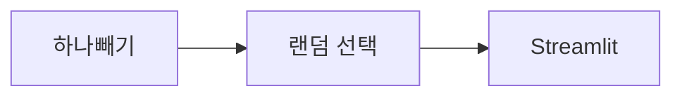

# DAY6 - 표준 라이브러리와 Streamlit

[원문 보기](https://velog.io/@doldolkoong/%ED%94%8C%EB%A0%88%EC%9D%B4%EB%8D%B0%EC%9D%B4%ED%84%B0-SK%EB%84%A4%ED%8A%B8%EC%9B%8D%EC%8A%A4-Family-AI-%EC%BA%A0%ED%94%84-36%EA%B8%B0-DAY6-2026.08.13) · 2026-09-08 정리

> [!attention] 원문 확인·보완
> datetime 생성자의 마지막 시간 필드는 밀리초가 아니라 마이크로초다.

> [!tip] 💡 이 수업을 한 문장으로
> 하나빼기 게임과 표준 라이브러리·Streamlit의 역할을 작은 예제로 연결한다.

> [!example] 🎨 한 줄 비유
> 반복해서 필요한 기능은 공구함에서 꺼내 쓰고 화면은 별도 작업대로 만든다.

## 📌 선행지식

| 필요한 지식 | 어느 정도로? | 관련 노트 |
|---|---|---|
| 가위바위보·묵찌빠·하나빼기 모듈화 | 핵심 용어와 입력·출력 흐름 설명 | [[가위바위보·묵찌빠·하나빼기 모듈화\|가위바위보·묵찌빠·하나빼기 모듈화]] |
| DAY7 - 묵찌빠 상태와 챗봇 구조 | 핵심 용어와 입력·출력 흐름 설명 | [[DAY7 - 묵찌빠 상태와 챗봇 구조\|DAY7 - 묵찌빠 상태와 챗봇 구조]] |

## 🎯 학습 목표

- [ ] 하나빼기 게임과 표준 라이브러리·Streamlit의 역할을 작은 예제로 연결한다.
- [ ] 하나빼기: 예제로 설명할 수 있다.
- [ ] 랜덤 선택: 예제로 설명할 수 있다.
- [ ] 표준 라이브러리: 예제로 설명할 수 있다.

## 1단원 — 핵심 정의 🟢 ⭐

### ① 무엇인가?

하나빼기 게임과 표준 라이브러리·Streamlit의 역할을 작은 예제로 연결한다.

### ② 왜 필요한가?

게임 입력 개수·허용 값·최종 선택 조건을 정한다. 로직과 화면을 나누고 반복 실행·예외 입력을 확인한다. 이를 통해 하나빼기에서 Streamlit까지 연결해 이해한다.

### ③ 쉽게 이해하기 🎨

> [!example] 비유
> 반복해서 필요한 기능은 공구함에서 꺼내 쓰고 화면은 별도 작업대로 만든다.

### ④ 핵심 용어

| 용어 | 뜻과 적용 포인트 |
|---|---|
| 하나빼기 | 두 손을 고른 뒤 하나를 남겨 승패를 판단한다. 원문은 무승부 재시작을 목표로 했다. |
| 랜덤 선택 | choices는 중복 선택이 가능하고 sample은 같은 위치를 중복 선택하지 않는다. |
| 표준 라이브러리 | Counter·math·datetime·urllib.parse·re로 빈도·수치·시간·문자열을 처리한다. |
| 정규표현식 | 문자 패턴을 찾거나 검증하며 복잡한 HTML 구조는 전용 파서로 다루는 편이 적절하다. |
| Streamlit | Python 함수로 화면을 구성하며 입력 이벤트 때 스크립트가 다시 실행되는 흐름을 이해한다. |

## 2단원 — 원리 / 동작 과정 🔵 ⭐

### ① 전체 흐름

1. 게임 입력 개수·허용 값·최종 선택 조건을 정한다.
2. 필요한 기능을 표준 라이브러리로 구현한다.
3. 로직과 화면을 나누고 반복 실행·예외 입력을 확인한다.

### ② 왜 이렇게 동작하는가?

choices는 중복 선택이 가능하고 sample은 같은 위치를 중복 선택하지 않는다. Python 함수로 화면을 구성하며 입력 이벤트 때 스크립트가 다시 실행되는 흐름을 이해한다.

### ③ 그림으로 설명



## 3단원 — 코드 / 공식 🔵 ⭐

### ① 핵심 코드

> 아래는 원문의 개념을 작은 입력으로 재구성한 학습용 예제다. 원문 코드는 하단 원문에서 확인할 수 있다.

```python
from collections import Counter
from datetime import datetime, timedelta
print(dict(Counter(['aa','aa','bb'])))
d = datetime(2026, 8, 13)
print((d + timedelta(days=1)).strftime('%Y-%m-%d'))
```

### ② 코드 이해

| 읽는 순서 | 의미 |
|---|---|
| 입력과 전제 | 게임 입력 개수·허용 값·최종 선택 조건을 정한다. |
| 처리 | 필요한 기능을 표준 라이브러리로 구현한다. |
| 결과 | Counter는 빈도를, timedelta는 날짜 차이를 표현한다. |

### ③ 실행 결과

**예상 결과·해석 기준 — 실제 환경 실행 결과와 구분**

```text
{'aa': 2, 'bb': 1}
2026-08-14
```

### ④ 결과 해석

Counter는 빈도를, timedelta는 날짜 차이를 표현한다.

## 4단원 — 실습 🚀

### 🧪 실습

**문제**

서로 다른 후보 3개에서 중복 가능한 2개 선택과 중복 없는 2개 선택은?

**내 코드 / 내 풀이**

> 직접 풀이한 뒤 이 칸에 기록한다. 아래 해설을 보기 전에 먼저 답을 생각한다.

**결과·해석**

<details>
<summary>해설 보기</summary>

각각 random.choices(items,k=2), random.sample(items,k=2)를 사용한다. 원본 후보 자체의 중복 여부도 고려한다.

</details>

## 🔧 디버깅 포인트

| 증상 | 원인 | 해결 |
|---|---|---|
| 최종 선택이 처음 고른 두 손 밖임 | 허용값 전체만 검사 | 처음 선택한 두 손 안에 있는지 검사 |
| 날짜 마지막 숫자를 밀리초로 해석 | datetime 정밀도 혼동 | microsecond는 마이크로초 단위 |

## 🤖 ChatGPT 요약 붙여넣기

### 📚 이번 수업에서 배운 내용

- **하나빼기**: 두 손을 고른 뒤 하나를 남겨 승패를 판단한다. 원문은 무승부 재시작을 목표로 했다.
- **랜덤 선택**: choices는 중복 선택이 가능하고 sample은 같은 위치를 중복 선택하지 않는다.
- **표준 라이브러리**: Counter·math·datetime·urllib.parse·re로 빈도·수치·시간·문자열을 처리한다.
- **정규표현식**: 문자 패턴을 찾거나 검증하며 복잡한 HTML 구조는 전용 파서로 다루는 편이 적절하다.
- **Streamlit**: Python 함수로 화면을 구성하며 입력 이벤트 때 스크립트가 다시 실행되는 흐름을 이해한다.

### 🔑 핵심 문장 3개

1. 하나빼기 게임과 표준 라이브러리·Streamlit의 역할을 작은 예제로 연결한다.
2. choices는 중복 선택이 가능하고 sample은 같은 위치를 중복 선택하지 않는다.
3. Python 함수로 화면을 구성하며 입력 이벤트 때 스크립트가 다시 실행되는 흐름을 이해한다.

### ⚠️ 시험 / 면접 포인트

- 하나빼기의 핵심은 무엇인가?
- 랜덤 선택를 잘못 이해하면 어떤 문제가 생기는가?
- 서로 다른 후보 3개에서 중복 가능한 2개 선택과 중복 없는 2개 선택은?

### ✅ 개념 체크리스트

- [ ] 하나빼기의 의미와 원문에서 사용한 이유를 설명할 수 있는가?
- [ ] 랜덤 선택의 의미와 원문에서 사용한 이유를 설명할 수 있는가?
- [ ] 표준 라이브러리의 의미와 원문에서 사용한 이유를 설명할 수 있는가?
- [ ] 정규표현식의 의미와 원문에서 사용한 이유를 설명할 수 있는가?
- [ ] Streamlit의 의미와 원문에서 사용한 이유를 설명할 수 있는가?

### ⚠️ 실수 방지 체크리스트

| 흔한 실수 | 바로잡기 |
|---|---|
| 최종 선택이 처음 고른 두 손 밖임 | 처음 선택한 두 손 안에 있는지 검사 |
| 날짜 마지막 숫자를 밀리초로 해석 | microsecond는 마이크로초 단위 |

### 📝 미니 연습문제

1. 하나빼기의 핵심은 무엇인가?

<details>
<summary>해설 보기</summary>

두 손을 고른 뒤 하나를 남겨 승패를 판단한다. 원문은 무승부 재시작을 목표로 했다.

</details>

2. 랜덤 선택를 잘못 이해하면 어떤 문제가 생기는가?

<details>
<summary>해설 보기</summary>

choices는 중복 선택이 가능하고 sample은 같은 위치를 중복 선택하지 않는다.

</details>

3. 코드 또는 처리 예시의 결과를 설명하라.

<details>
<summary>해설 보기</summary>

Counter는 빈도를, timedelta는 날짜 차이를 표현한다.

</details>

4. 서로 다른 후보 3개에서 중복 가능한 2개 선택과 중복 없는 2개 선택은?

<details>
<summary>해설 보기</summary>

각각 random.choices(items,k=2), random.sample(items,k=2)를 사용한다. 원본 후보 자체의 중복 여부도 고려한다.

</details>

# 🔁 복습 스케줄

- [ ] **1일 복습** [stage:: 1D] [due:: 2026-09-09]
- [ ] **7일 복습** [stage:: 7D] [due:: 2026-09-15]
- [ ] **30일 복습** [stage:: 30D] [due:: 2026-10-08]

### 복습 방법

1. 요약을 가리고 핵심 개념 3개를 설명한다.
2. 예제 또는 처리 흐름을 보지 않고 재현한다.
3. 해설과 비교하고 틀린 부분을 기록한다.
4. 실제 복습을 마친 뒤 체크한다.

## 🔗 관련 노트

- [[가위바위보·묵찌빠·하나빼기 모듈화|가위바위보·묵찌빠·하나빼기 모듈화]]
- [[DAY7 - 묵찌빠 상태와 챗봇 구조|DAY7 - 묵찌빠 상태와 챗봇 구조]]
- [[DAY4 - 함수와 특수 함수|DAY4 - 함수와 특수 함수]]
- [[00_Dashboard/Velog 학습 자료 목차|전체 32개 글 목차]]

## 📎 원문과 확인 자료

- [Velog 원문](https://velog.io/@doldolkoong/%ED%94%8C%EB%A0%88%EC%9D%B4%EB%8D%B0%EC%9D%B4%ED%84%B0-SK%EB%84%A4%ED%8A%B8%EC%9B%8D%EC%8A%A4-Family-AI-%EC%BA%A0%ED%94%84-36%EA%B8%B0-DAY6-2026.08.13)


> [!quote]- 원문 전체 보기 — 코드·표·이미지 링크 포함
> ![[90_Sources/Velog/25 - DAY6 - 표준 라이브러리와 Streamlit - 원문]]
