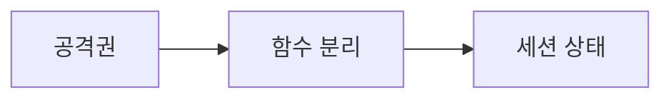

# DAY7 - 묵찌빠 상태와 챗봇 구조

[원문 보기](https://velog.io/@doldolkoong/%ED%94%8C%EB%A0%88%EC%9D%B4%EB%8D%B0%EC%9D%B4%ED%84%B0-SK%EB%84%A4%ED%8A%B8%EC%9B%8D%EC%8A%A4-Family-AI-%EC%BA%A0%ED%94%84-36%EA%B8%B0-DAY7-2026.08.14) · 2026-09-08 정리

> [!attention] 원문 확인·보완
> 제목 DAY7(08-14)과 본문 첫 DAY6(08-13) 표기가 다르다. 제목 기준으로 정리했다.

> [!tip] 💡 이 수업을 한 문장으로
> 묵찌빠 공격권과 챗봇 대화 이력처럼 다음 동작에 필요한 상태를 관리한다.

> [!example] 🎨 한 줄 비유
> 대화와 게임 모두 직전 상황을 기억해야 다음 차례를 올바르게 진행할 수 있다.

## 📌 선행지식

| 필요한 지식 | 어느 정도로? | 관련 노트 |
|---|---|---|
| 가위바위보·묵찌빠·하나빼기 모듈화 | 핵심 용어와 입력·출력 흐름 설명 | [[가위바위보·묵찌빠·하나빼기 모듈화\|가위바위보·묵찌빠·하나빼기 모듈화]] |
| DAY6 - 표준 라이브러리와 Streamlit | 핵심 용어와 입력·출력 흐름 설명 | [[DAY6 - 표준 라이브러리와 Streamlit\|DAY6 - 표준 라이브러리와 Streamlit]] |

## 🎯 학습 목표

- [ ] 묵찌빠 공격권과 챗봇 대화 이력처럼 다음 동작에 필요한 상태를 관리한다.
- [ ] 공격권: 예제로 설명할 수 있다.
- [ ] 함수 분리: 예제로 설명할 수 있다.
- [ ] 구체적인 주석: 예제로 설명할 수 있다.

## 1단원 — 핵심 정의 🟢 ⭐

### ① 무엇인가?

묵찌빠 공격권과 챗봇 대화 이력처럼 다음 동작에 필요한 상태를 관리한다.

### ② 왜 필요한가?

게임 상태 또는 채팅 메시지 구조를 정의한다. 반복 실행 시 상태가 유지되는지와 종료·오류 경로를 확인한다. 이를 통해 공격권에서 세션 상태까지 연결해 이해한다.

### ③ 쉽게 이해하기 🎨

> [!example] 비유
> 대화와 게임 모두 직전 상황을 기억해야 다음 차례를 올바르게 진행할 수 있다.

### ④ 핵심 용어

| 용어 | 뜻과 적용 포인트 |
|---|---|
| 공격권 | 첫 승패로 공격자를 정한 뒤 같은 손이 나오면 현재 공격자가 이긴다. |
| 함수 분리 | 입력·컴퓨터 선택·승패·출력의 반복 부분을 분리한다. |
| 구체적인 주석 | 처리 주체와 데이터 저장·계산 동작을 명확하게 적는다. |
| 챗봇 구성 | constants·show·app·history·ai로 화면·기록·호출 책임을 나눈다. |
| 세션 상태 | 대화 메시지의 role·content를 저장하고 화면 재실행 후에도 이력을 사용한다. |

## 2단원 — 원리 / 동작 과정 🔵 ⭐

### ① 전체 흐름

1. 게임 상태 또는 채팅 메시지 구조를 정의한다.
2. 입력 검증과 상태 갱신을 UI 출력·외부 호출과 분리한다.
3. 반복 실행 시 상태가 유지되는지와 종료·오류 경로를 확인한다.

### ② 왜 이렇게 동작하는가?

입력·컴퓨터 선택·승패·출력의 반복 부분을 분리한다. 대화 메시지의 role·content를 저장하고 화면 재실행 후에도 이력을 사용한다.

### ③ 그림으로 설명



## 3단원 — 코드 / 공식 🔵 ⭐

### ① 핵심 코드

> 아래는 원문의 개념을 작은 입력으로 재구성한 학습용 예제다. 원문 코드는 하단 원문에서 확인할 수 있다.

```python
messages = []
messages.append({'role':'user', 'content':'안녕'})
messages.append({'role':'assistant', 'content':'반가워요'})
print([m['role'] for m in messages])
```

### ② 코드 이해

| 읽는 순서 | 의미 |
|---|---|
| 입력과 전제 | 게임 상태 또는 채팅 메시지 구조를 정의한다. |
| 처리 | 입력 검증과 상태 갱신을 UI 출력·외부 호출과 분리한다. |
| 결과 | 대화 이력 구조만 보여주는 로컬 예제다. API를 호출해 생성한 답변이 아니다. |

### ③ 실행 결과

**예상 결과·해석 기준 — 실제 환경 실행 결과와 구분**

```text
['user', 'assistant']
```

### ④ 결과 해석

대화 이력 구조만 보여주는 로컬 예제다. API를 호출해 생성한 답변이 아니다.

## 4단원 — 실습 🚀

### 🧪 실습

**문제**

채팅에서 문자열만 저장하지 않고 role도 저장하는 이유는?

**내 코드 / 내 풀이**

> 직접 풀이한 뒤 이 칸에 기록한다. 아래 해설을 보기 전에 먼저 답을 생각한다.

**결과·해석**

<details>
<summary>해설 보기</summary>

사용자 발화와 모델 응답의 주체 및 대화 순서를 구별하기 위해서다.

</details>

## 🔧 디버깅 포인트

| 증상 | 원인 | 해결 |
|---|---|---|
| 화면 재실행 때 대화 이력 사라짐 | 일반 변수만 매번 초기화 | session_state 존재 여부를 확인하고 최초 한 번 초기화 |
| 게임·UI·호출이 한 함수에 뒤섞임 | 역할과 반환값 미정 | 함수별 입력·출력·상태 변경 책임 명시 |

## 🤖 ChatGPT 요약 붙여넣기

### 📚 이번 수업에서 배운 내용

- **공격권**: 첫 승패로 공격자를 정한 뒤 같은 손이 나오면 현재 공격자가 이긴다.
- **함수 분리**: 입력·컴퓨터 선택·승패·출력의 반복 부분을 분리한다.
- **구체적인 주석**: 처리 주체와 데이터 저장·계산 동작을 명확하게 적는다.
- **챗봇 구성**: constants·show·app·history·ai로 화면·기록·호출 책임을 나눈다.
- **세션 상태**: 대화 메시지의 role·content를 저장하고 화면 재실행 후에도 이력을 사용한다.

### 🔑 핵심 문장 3개

1. 묵찌빠 공격권과 챗봇 대화 이력처럼 다음 동작에 필요한 상태를 관리한다.
2. 입력·컴퓨터 선택·승패·출력의 반복 부분을 분리한다.
3. 대화 메시지의 role·content를 저장하고 화면 재실행 후에도 이력을 사용한다.

### ⚠️ 시험 / 면접 포인트

- 공격권의 핵심은 무엇인가?
- 함수 분리를 잘못 이해하면 어떤 문제가 생기는가?
- 채팅에서 문자열만 저장하지 않고 role도 저장하는 이유는?

### ✅ 개념 체크리스트

- [ ] 공격권의 의미와 원문에서 사용한 이유를 설명할 수 있는가?
- [ ] 함수 분리의 의미와 원문에서 사용한 이유를 설명할 수 있는가?
- [ ] 구체적인 주석의 의미와 원문에서 사용한 이유를 설명할 수 있는가?
- [ ] 챗봇 구성의 의미와 원문에서 사용한 이유를 설명할 수 있는가?
- [ ] 세션 상태의 의미와 원문에서 사용한 이유를 설명할 수 있는가?

### ⚠️ 실수 방지 체크리스트

| 흔한 실수 | 바로잡기 |
|---|---|
| 화면 재실행 때 대화 이력 사라짐 | session_state 존재 여부를 확인하고 최초 한 번 초기화 |
| 게임·UI·호출이 한 함수에 뒤섞임 | 함수별 입력·출력·상태 변경 책임 명시 |

### 📝 미니 연습문제

1. 공격권의 핵심은 무엇인가?

<details>
<summary>해설 보기</summary>

첫 승패로 공격자를 정한 뒤 같은 손이 나오면 현재 공격자가 이긴다.

</details>

2. 함수 분리를 잘못 이해하면 어떤 문제가 생기는가?

<details>
<summary>해설 보기</summary>

입력·컴퓨터 선택·승패·출력의 반복 부분을 분리한다.

</details>

3. 코드 또는 처리 예시의 결과를 설명하라.

<details>
<summary>해설 보기</summary>

대화 이력 구조만 보여주는 로컬 예제다. API를 호출해 생성한 답변이 아니다.

</details>

4. 채팅에서 문자열만 저장하지 않고 role도 저장하는 이유는?

<details>
<summary>해설 보기</summary>

사용자 발화와 모델 응답의 주체 및 대화 순서를 구별하기 위해서다.

</details>

# 🔁 복습 스케줄

- [ ] **1일 복습** [stage:: 1D] [due:: 2026-09-09]
- [ ] **7일 복습** [stage:: 7D] [due:: 2026-09-15]
- [ ] **30일 복습** [stage:: 30D] [due:: 2026-10-08]

### 복습 방법

1. 요약을 가리고 핵심 개념 3개를 설명한다.
2. 예제 또는 처리 흐름을 보지 않고 재현한다.
3. 해설과 비교하고 틀린 부분을 기록한다.
4. 실제 복습을 마친 뒤 체크한다.

## 🔗 관련 노트

- [[가위바위보·묵찌빠·하나빼기 모듈화|가위바위보·묵찌빠·하나빼기 모듈화]]
- [[DAY6 - 표준 라이브러리와 Streamlit|DAY6 - 표준 라이브러리와 Streamlit]]
- [[DAY5 - Enum과 클래스 및 모듈|DAY5 - Enum과 클래스 및 모듈]]
- [[00_Dashboard/Velog 학습 자료 목차|전체 32개 글 목차]]

## 📎 원문과 확인 자료

- [Velog 원문](https://velog.io/@doldolkoong/%ED%94%8C%EB%A0%88%EC%9D%B4%EB%8D%B0%EC%9D%B4%ED%84%B0-SK%EB%84%A4%ED%8A%B8%EC%9B%8D%EC%8A%A4-Family-AI-%EC%BA%A0%ED%94%84-36%EA%B8%B0-DAY7-2026.08.14)


> [!quote]- 원문 전체 보기 — 코드·표·이미지 링크 포함
> ![[90_Sources/Velog/24 - DAY7 - 묵찌빠 상태와 챗봇 구조 - 원문]]
